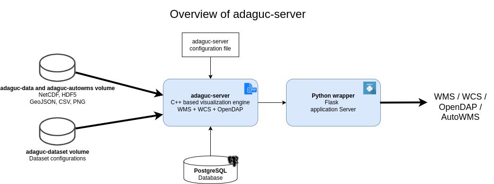

# Adaguc-server

Adaguc-server is an open source geographical information system to visualize, combine, compare and share real-time meteorological, climatological and remote sensing data via OGC standards.

Visualization and data serving is based on the Web Map Service (WMS) and Web Coverage Service (WCS) specifications from the Open Geospatial Consortium. This ensures that web services offered by Adaguc-server can be used in other geographical information systems, e.g. using and adhering to standards should allow for interoperability between systems. 

The Adaguc-server is designed to compare datasets in space and time by offering geographical maps, histograms, ensembles and time-series of atmospheric datasets. The Adaguc-server supports real time update and aggregation of data streams, making data from radars, satellites and operational weather models accessible as a webservice. 

The system accepts data in large or small chunks, the data can be given to the system in many smaller files if necessary. The server reprojects the geographical data to allow spatial comparisons of different geographical projections. 

Graphical representations of the data can be made using contour lines, shading, hillshading, nearest neighbour rendering and symbology. The Adaguc-server is used to provide open access to meteorological data and to provide visualizations for a web based meteorological working station.

## Overview

* [Using adaguc-server with Docker](./doc/Running.md)
* [Tutorials](./doc/tutorials/Readme.md)
* [For developers - installing dependencies](./doc/Developing.md)
* [Configuration](./doc/configuration/Configuration.md)
* [Environment variables and exit codes](./doc/EnvironmentVariablesAndExitCodes.md)
* [Format standard](./doc/format_standard/README.md)
* [Glossary](./doc/GLOSSARY.md)
* [Quick Tips](./doc/overview/QuickTips.md)
* [Profiling](./doc/developing/profiling.md)
* [Testing](./doc/developing/testing.md)

For our detailed paper please read https://doi.org/10.5334/jors.382

