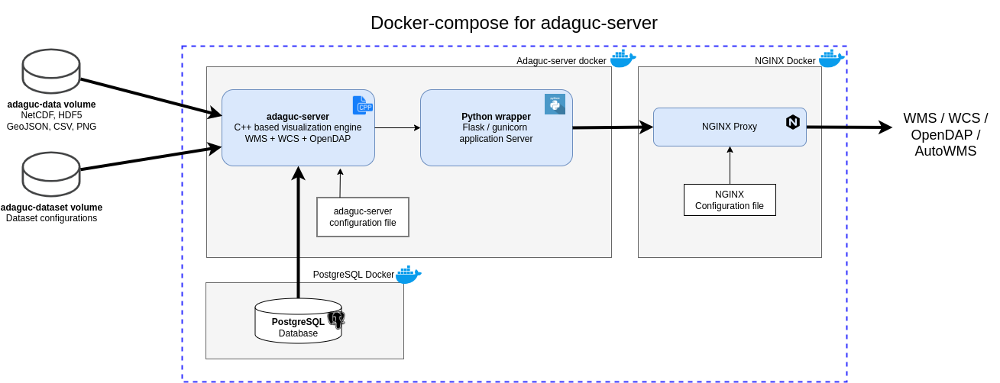

# Running adaguc-server with docker

[Back to readme](../Readme.md)

The easiest way to make use of the adaguc-server is via docker containers. Docker images for the adaguc system are hosted at [dockerhub](https://hub.docker.com/r/openearth/adaguc-server/). The required docker containers can be started with docker-compose. The docker compose file can be found in the Docker folder. Detailed instructions can be found below.


## Start adaguc via Docker (compose)

Adaguc comprises the following components run in separate containers:

1. adaguc-server
2. adaguc-viewer
3. nginx webserver
4. postgresql database



## Directories and data
The most important directories are:
* adaguc-data: Put your NetCDF, HDF5, GeoJSON or PNG files inside this directory, these are referenced by your dataset configurations.
* adaguc-datasets: These are your dataset configuration files, defining a service. These are small XML files allowing you to customize the styling and aggregation of datafiles.  Datasets are referenced in the WMS service by the dataset=<Your datasetname> keyword.
* adaguc-autowms: Put your files here you want to have visualised automatically without any scanning. Go to the /autowms endpoint to see its contents.


### Step 1. Clone the source code and cd into the Docker folder:

```
git clone https://github.com/KNMI/adaguc-server/
cd adaguc-server/Docker
```

### Step 2. A script is available to generate the required .env file with the directories needed for docker-compose:

```
# Generate environment for adaguc:
export ADAGUCDOCKERHOME=${HOME}/adaguc-docker
bash docker-compose-generate-env.sh \
  -a $ADAGUCDOCKERHOME/adaguc-autowms \
  -d $ADAGUCDOCKERHOME/adaguc-datasets \
  -f $ADAGUCDOCKERHOME/adaguc-data \
  -p 443
# You can view or edit the file ./.env file
```

### Step 3. Once the steps above have been done, it is time to start:

```
docker compose up -d --build && sleep 10
```

### Step 4. Visit the url as configured in the .env file under EXTERNALADDRESS. 

For example with firefox:
```
. .env && firefox ${EXTERNALADDRESS}
```

Note: The server runs with a self signed certificate, this means you get a warning. Accept this warning and add the exception.

If you now see the viewer, you have succesfully started the adaguc-server.


## Scanning datasets

Scan with the adaguc-server container:
```
docker exec -i -t my-adaguc-server /adaguc/scan.sh -l
docker exec -i -t my-adaguc-server /adaguc/scan.sh <optional -d datasetname>
```

## Visit the webservice:

The docker-compose-generate-env.sh tells you where you services can be accessed in the browser. Alternatively you can have a look at the ./adaguc-server/Docker/.env file

```
cat ./adaguc-server/Docker/.env

```

The webservices should now be accessible via :
```
https://<your hostname>/
```
or, if you specified a port other than 443
```
https://&lt;your hostname&gt;:&lt;port&gt;/
```

Note:
* _The first time you acces the service,  your browser will show a warning that there is a problem with the certificate. Make an exception for this service._


## To view logs:
```
docker logs -f my-adaguc-server
```

## To stop:
```
docker compose down
```

## Tip: About directories inside containers

To check what folders you have assigned to the adaguc-server container, easiest is to look into the .env file in the Docker folder:

```
cat .env

# outputs:

ADAGUC_DATA_DIR=/home/plieger/adaguc-docker/adaguc-data
ADAGUC_AUTOWMS_DIR=/home/plieger/adaguc-docker/adaguc-autowms
ADAGUC_DATASET_DIR=/home/plieger/adaguc-docker/adaguc-datasets
ADAGUC_PORT=443
EXTERNALADDRESS=https://plieger-dell/
```

Note: The directories on your computer are always mapped to the same directories in the docker container. This ensures that configuration files are interchangeable between systems.

Inside the docker container, ADAGUC_DATA_DIR is always /data/adaguc-data, ADAGUC_AUTOWMS_DIR is always /data/adaguc-autowms and ADAGUC_DATASET_DIR is always /data/adaguc-datasets.

A tip to list the actual contents in the docker container is to do:

```
docker exec -i -t my-adaguc-server bash -c "ls -lrt /data/adaguc-data"
docker exec -i -t my-adaguc-server bash -c "ls -lrt /data/adaguc-datasets"
```