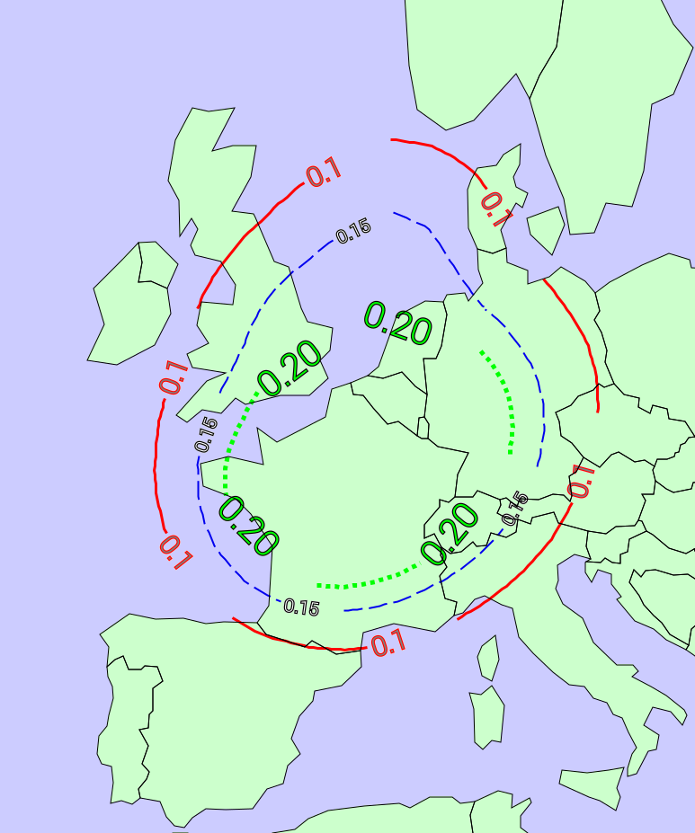

ContourLine (width,linecolor,textcolor,textformatting,interval,classes)
=======================================================================

Back to [Configuration](./Configuration.md)

-   width - The width of the line
-   linecolor - The color of the line in hexadecimal format \#RRGGBB
-   dashing - The dashing of the line. Comma separated list of values like "10,5"
-   textcolor - The color of the text in hexadecimal format \#RRGGBB
-   textstrokecolor - The outline color of the text in hexadecimal format \#RRGGBB
-   textsize - Fontsize in pixels (e.g. 15)
-   textformatting - How the text is displayed, using standard string
    formatting. Use "" for no text in contourlines
-   interval - Draw lines at every <n> value
-   classes - Comma separated list of values to draw lines on.

Draw Contourline at every degree:

```xml
<ContourLine width="0.3" linecolor="\#444444" textcolor="\#444444" textformatting="%2.0f" interval="1"/>
```

Draw Contourline at defined values:

```xml
<ContourLine width="0.3" linecolor="\#444444" textcolor="\#444444" textformatting="%2.0f" classes="10,25,50,100,150"/>
```


## Draw dashed contourlines:

```xml
<?xml version="1.0" encoding="UTF-8" ?>
<Configuration>

    <Settings cache_age_volatileresources="60" cache_age_cacheableresources="7200" />

    <Style name="testdata_style_manycontours">
        <ContourLine width="2" linecolor="#0000EE" textcolor="#FFFFFF" textstrokecolor="#000000" textsize="20.0" textformatting="%2.2f" classes="0.15" dashing="21,7"/>
        <ContourLine width="3" linecolor="#FF0000" textcolor="#808080" textstrokecolor="#FF0000" textsize="30.0" textformatting="%2.1f" classes="0.10"/>
        <ContourLine width="5" linecolor="#00FF00" textcolor="#00FF00" textstrokecolor="#000000" textsize="40.0" textformatting="%2.2f" classes="0.20" dashing="5,5"/>
        <RenderMethod>contour</RenderMethod>
    </Style>

    <!-- Layers -->

    <Layer type="database">
        <Name>dashed_contour_lines</Name>
        <FilePath filter="">/data/adaguc-data/testdata.nc</FilePath>
        <Title>Dashed contourlines</Title>
        <Variable>testdata</Variable>
        <Styles>testdata_style_manycontours</Styles>
    </Layer>

    <!-- End of configuration /-->
</Configuration>
```


Will give:



