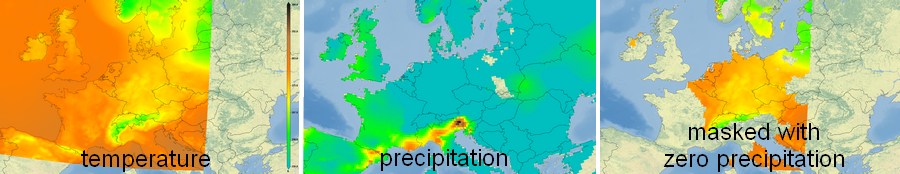

Datapostprocessors (algorithm, a, b, c, units, name, mode)
==========================================================

Back to [Configuration](./Configuration.md)

# Data postprocessors

Data postprocessors modify the data inside the adagucserver before any
further operations are applied. The modified data can be visualized
using WMS and retrieved using WCS. DataPostprocessors can be for example
simple unit conversions from Kelvin to Celsius.

-   algorithm - The Datapostprocessor to choose, e.g. "ax+b"
-   a - Input value a
-   b - Input value b
-   c - Input value c
-   units - The new units of the data.
-   name - name attributes, function depending on the processor
-   mode - additional settings for the processor

# Current data postprocessors:

1.  *CDPPAXplusB*             `algorithm="ax+b"`: Linear transformation ax+b - Suitable for unit conversions
2.  *CDPPIncludeLayer*        `algorithm="include_layer"`: Include another layer into your layer as new  dataobject
3.  *CDPPDATAMASK*            `algorithm="datamask"`: Mask one variable with another variable with several options
4.  *CDPPMSGCPPVisibleMask*   `algorithm="msgcppvisiblemask"` - Display the visible part of the disk
5.  *CDPPMSGCPPHIWCMask*      `algorithm="msgcpphiwcmask"`: Thresholds for detection of “High Ice Water Content”  according to HAIC case.
6.  *CDPPAddFeatures*         `algorithm="addfeatures"`: Turn geographical features (areas) into a grid
7.  *CDPPBeaufort*            `algorithm="beaufort"`: do conversion of wind speeds in m/s or kts to Beaufort values
8.  *CDPPToKnots*             `algorithm="toknots"`: do conversion of wind speeds in m/s to kts
9.  *CDPPWindSpeedKnotsToMs*  `algorithm="windspeed_knots_to_ms"`: do conversion of wind speeds in kts to m/s
10. *CDPDBZtoRR*              `algorithm="dbztorr"`: Converts dbz to mm/h for radata data
11. *CDPPGoes16Metadata*      `algorithm="goes16metadata"`: Adjusts Noaa goes16 NetCDF metadata to make it compatible with adaguc
12. *CDPPClipMinMax*          `algorithm="clipminmax"`: Clips min and max from the data
13. *CDPPOperator*            `algorithm="operator"`: Does numerical operators between two dataobjects and stores the result in a new one.
14. *CDPPWFP*                 `algorithm="WFP"`: Wind speed processor, can be used to adjust windspeed by lee of windfarms
15. *CDPPSolarTerminator*     `algorithm="solarterminator"`: Solar terminator processor, [Configure_solar_terminator](../../doc/tutorials/Configure_solar_terminator.md)
16. *CDDPUVComponents*        `algorithm="convert_uv_components"`: Data postprocessor to transform grid relative x and y components of a vector to relative to north components. In addition windspeed and winddirection is derived. This uses a jacobian transformation.
17. *CDDPFilterDataObjects*   `algorithm="filter_dataobjects"`: Filter out data objects from the GetMap and GetFeatureInfo responses. E.g. to hide components you do not want to show.
18. *CDDPMetadataVariable*    `algorithm="metadata_variable"`: Add extra metadata to the CDF Data model.
19.  *CDataPostProcessor_PointsFromGrid*  `algorithm="pointsfromgrid"`: Extracts point from a grid and makes them available for the point renderer
20.  *CDataPostProcessor_AddDataObject*  `algorithm="add_dataobject"`: Adds a new data object (variable) to the layer with a given value

New datapost processors can be implemented via
[CDataPostProcessor.cpp](../../adagucserverEC/CDataPostProcessors/CDataPostProcessor.cpp)

## 1. ax+b: Linear transformation ax+b - Suitable for unit conversions
-------------------------------------------------------------------

Example to convert cloudcover fraction to octa:
```xml
<DataPostProc algorithm="ax+b" a="8" b="0" units="octa"/>
```

## 2. include_layer: Include another layer into your layer as new dataobject
--------------------------------------------------------------------------

-   Available since adagucserver version 2.0.9

This processor includes another layer in your current layer. The
variables configured in the other layer are added to your new layer.
These are visible in the GetFeatureInfo and GetMetadata request. This is
for example useful if u and v vectors are in two separate files. This
processor allows you to combine them into one layer.
**Note:** The two layers do not need to have the same gridsize and
projection, the other layer will be transformed to fit into the new
layer. The grids will be made the same.

-   algorithm: should be set to "include_layer"
-   name: the other configured layer you wish to include
-   mode: prepend or append, e.g. will the new layer be put in front of
    the current variables or after.

```xml
<Layer>
  ...
  <Name>theotherlayer</Name>
  ...
</Layer>

<Layer>
  ...
  <Name>combinedlayer</Name>
  <DataPostProc algorithm="include_layer" name="theotherlayer" mode="prepend"/>
  ...
</Layer>
```

It is for example also possible to create a layer with 3 variables,
minimum, average and maximum temperature:
```xml
<Layer type="database">
  <Name>t2minlayer</Name>
  <Title>t2minlayer</Title>
  <FilePath>http://opendap.knmi.nl/knmi/thredds/dodsC/ADAGUC/testsets/projectedgrids/t2min.KNMI-2014.KNXT12.HCAST2.DD.nc.fixed.nc</FilePath>
  <Variable>t2min</Variable>
  <Styles>auto</Styles>
</Layer>

<Layer type="database">
  <Name>t2maxlayer</Name>
  <Title>t2maxlayer</Title>
  <FilePath>http://opendap.knmi.nl/knmi/thredds/dodsC/ADAGUC/testsets/projectedgrids/t2max.KNMI-2014.KNXT12.HCAST2.DD.nc.fixed.nc</FilePath>
  <Variable>t2max</Variable>
  <Styles>auto</Styles>
</Layer>

<Layer type="database">
  <Name>combinedlayer</Name>
  <Title>combinedlayer</Title>
  <FilePath>http://opendap.knmi.nl/knmi/thredds/dodsC/ADAGUC/testsets/projectedgrids/t2m.KNMI-2014.KNXT12.HCAST2.DD.nc.fixed.nc</FilePath>
  <Variable>t2m</Variable>
  <Styles>auto</Styles>
  <Min>250</Min>
  <Max>300</Max>
  <DataPostProc algorithm="include_layer" name="t2minlayer" mode="prepend"/>
  <DataPostProc algorithm="include_layer" name="t2maxlayer" mode="append"/>
</Layer>
```

A get featureinfo request will show the 3 values for a point:
```
Coordinates - (lon=5.25; lat=51.96)
Minimum 2-m Temperature (secondlayer)
     -    Minimum 2-m Temperature    279.701904    K
     -    2-m Temperature    281.849213    K
     -    Maximum 2-m Temperature    284.590302    K
```

## 3. datamask: Mask one variable with another variable with several options
-------------------------------------------------------------------------

-   Available since adagucserver version 2.0.9

This datapostproc allows to mask a layer with two variables defined. The
first variable is the data and the second variable is the mask.

-   algorithm: should be set to "datamask"
-   a : the lower comparison value. All values higher or equal to a are
    included as mask
-   b : the upper comparison value. All values lower or equal to a are
    included as mask
    -   Mask is active when a>=maskvalue and b<=maskvalue.
-   mode : optional, the masking operation, can be
    -   if_mask_includes_then_nodata_else_data, fills in nodata,
        e.g. areas become transparent
    -   if_mask_excludes_then_nodata_else_data, fills in nodata,
        e.g. areas become transparent
    -   if_mask_includes_then_valuec_else_data, value c will be
        used
    -   if_mask_excludes_then_valuec_else_data, value c will be
        used
    -   if_mask_includes_then_mask_else_data, combines the sets
    -   if_mask_excludes_then_mask_else_data, combines the sets
-   c : optional, the value to write when mask applies
-   name : optional, the new long_name of the mask
-   units : optional, the new units of the mask

Example usage:

```xml
<DataPostProc algorithm="datamask" a="0" b="0" name="newmask" units="newunits" c="0" mode="if_mask_excludes_then_nodata_else_data"/>
```

Two variables need to be defined in the layer. This can be done by
adding an extra <Variable>...varname..</Variable> element in
the Layer config if the corresponding file has the two variables. If the
masking variable is in another file, it can be added by using the
datapostproc include_layer. The example below uses two different files
with different grid to create a masked result.

### Study case: Only display temperature field where precipitation is zero

This example demonstrates how a temperature field can be masked by
precipitation. By using the include_layer postproc first, the layer
gets two variables. The first variable is the temperature from the KNMI
next scenarios, the second variable is precipitation from EOBS gridded
observations. Both grids are very different and are regridded to the
grid as used by the temperature variable (e.g. the original variable
from this layer).


Configuration which has been used to create image above:
```xml
<Layer type="database">
    <Name>temperature</Name>
    <Title>temperature</Title>
    <FilePath>http://opendap.knmi.nl/knmi/thredds/dodsC/ADAGUC/testsets/projectedgrids/t2m.KNMI-2014.KNXT12.HCAST2.DD.nc.fixed.nc</FilePath>
    <Variable>t2m</Variable>
    <Styles>auto</Styles>
    <Min>250</Min>
    <Max>300</Max>
  </Layer>

  <Layer type="database">
    <Name>precipitation</Name>
    <Title>precipitation</Title>
    <FilePath>http://opendap.knmi.nl/knmi/thredds/dodsC/e-obs_0.25regular/rr_0.25deg_reg_v15.0.nc</FilePath>
    <Variable>rr</Variable>
    <Styles>auto</Styles>
  </Layer>

  <Layer type="database">
    <Name>masked</Name>
    <Title>masked</Title>
    <FilePath>http://opendap.knmi.nl/knmi/thredds/dodsC/ADAGUC/testsets/projectedgrids/t2m.KNMI-2014.KNXT12.HCAST2.DD.nc.fixed.nc</FilePath>
    <Variable>t2m</Variable>
    <Styles>auto</Styles>
    <Min>250</Min>
    <Max>300</Max>
    <DataPostProc algorithm="include_layer" name="precipitation" mode="append"/>
    <DataPostProc algorithm="datamask" a="0" b="0" name="newmask" units="newunits" c="0" mode="if_mask_excludes_then_nodata_else_data"/>
  </Layer>
```

## 4. MSGCPP VISIBLE-mask - Display the visible part of the disk
-------------------------------------------------------------

Based on sunz and satz.
Parameter a is sunz+satz threshold and b is satz threshold

```xml
<Layer type="database">
    <Group value="auxiliary" />
    <Name force="true">mask</Name>
    <Title>Mask (-)</Title>
    <DataBaseTable>msgcpp_0001</DataBaseTable>
    <Variable>sunz</Variable>
    <Variable>satz</Variable>
    <RenderMethod>nearest</RenderMethod>
    <FilePath filter="^SEVIR_OPER_R___MSGCPP__L2.*\.nc$">/data/ogcrt/data/temporary/</FilePath>
    <Styles>mask,red,green,blue</Styles>
    <Dimension name="time" interval="PT15M">time</Dimension>
    <LatLonBox minx="-80" maxx="80" miny="-82" maxy="82" />
    <Cache enabled="false" />
    <DataPostProc algorithm="msgcppvisiblemask" a="78" b="80" />
    <ImageText>source: EUMETSAT/KNMI</ImageText>
  </Layer>
```

## 5. MSGCPP HIWC-mask - Used for detecting high ice water content derived from four input variables.
--------------------------------------------------------------------------------------------------

MSGCPP HIWC-mask: Thresholds for detection of “High Ice Water Content”
according to HAIC case.
\* - The cloud phase is ice
\* - Cloud water path is > 0.1 kg/m2
\* - Cloud top temperature < 270 K
\* - Cloud optical thickness > 20

```xml
 <Layer type="database">
    <Group value="auxiliary" />
    <Name force="true">hiwc</Name>
    <Title>High Ice Water Content (-)</Title>
    <DataBaseTable>msgcpp_0001</DataBaseTable>
    <Variable>cph</Variable>
    <Variable>cwp</Variable>
    <Variable>ctt</Variable>
    <Variable>cot</Variable>
    <RenderMethod>nearest</RenderMethod>
    <FilePath filter="^SEVIR_OPER_R___MSGCPP__L2.*\.nc$">/data/ogcrt/data/temporary/</FilePath>
    <Styles>red,green,blue,mask,gray_red,gray_green,gray_blue</Styles>
    <Dimension name="time" interval="PT15M">time</Dimension>
    <LatLonBox minx="-80" maxx="80" miny="-82" maxy="82" />
    <Cache enabled="false" />
    <DataPostProc algorithm="msgcpphiwcmask" a="78" b="80" />
    <ImageText>source: EUMETSAT/KNMI</ImageText>
  </Layer>
```

## 6. *CDPPAddFeatures* `algorithm="addfeatures"` - Colour geographical features according to point values
---------------------------------------------------------

A common case is to have data for a set of geographical features, for
example mean wind per province. These data can be stored in a netCDF
file as point data. A geoJSON file with the geographical information for
the features can then be coupled to the point data (by matching station
name in the point file with the name or id property in the geoJSON
file). This enables ADAGUC to draw the geographical features, coloured
according to the value in the point file.

For example, let's say we have a netCDF poimt file with the maximum
windspeed for 3 areas:
```
ncdump  windareas.nc
netcdf windareas {
dimensions:
        time = 1 ;
        station = 3 ;
variables:
        double time(time) ;
                time:standard_name = "time" ;
                time:units = "seconds since 1970-1-1" ;
        double lon(station) ;
                lon:standard_name = "longitude" ;
                lon:units = "degrees_east" ;
        double lat(station) ;
                lat:standard_name = "latitude" ;
                lat:units = "degrees_north" ;
        string station(station) ;
                station:long_name = "station_name" ;
                station:cf_role = "timeseries_id" ;
        double maxw(station, time) ;
                maxw:units = "m/s" ;
                maxw:standard_name = "maximum_windspeed" ;
                maxw:grid_mapping = "projection" ;
        char projection ;
                projection:proj4 = "+proj=longlat +ellps=WGS84 +datum=WGS84 +no_defs" ;

// global attributes:
                :Conventions = "CF-1.5" ;
                :featureType = "timeSeries" ;
data:
 time = 1458226800 ;
 lon = 4.86, 5.73, 6.61 ;
 lat = 52.8, 53.04, 53.17 ;
 station = "23", "34", "67" ;
 maxw =
  30.2,
  18.2,
  6.5 ;
 projection = "" ;
}
```


As point data this file could be displayed as:


The geographical information for the wind areas could be in the
windareas.geojson file:
```
{ "type":"FeatureCollection","bbox":[2.0,48.0,8.0,55.0],
"features":[
  {"type":"Feature","id":"67", "properties":{"name":"GR"},"geometry":{"type":"Polygon","coordinates":[[[6.976318359375,53.4291738804146],[6.13037109375,53.40298249424814],[6.15234375,52.928774525801366],[7.05322265625,52.93539665862318],[6.976318359375,53.4291738804146]]]}},
  {"type":"Feature","id":"34", "properties":{"name":"FR"},"geometry":{"type":"Polygon","coordinates":[[[6.141357421875,53.409531853086435],[5.38330078125,53.32431151982718],[5.328369140625,52.796119005678506],[6.15234375,52.80940281068805],[6.141357421875,53.409531853086435]]]}},
  {"type":"Feature","id":"23", "properties":{"name":"WFR"},"geometry":{"type":"Polygon","coordinates":[[[4.6,52.7],[4.6,53],[5.2,53],[5.2,52.7],[4.6,52.7]]]}}
]}
```

The addfeature datapostproc can join these two files, by generating a
grid where each grid cell has the value of the maxwind in the grid cell
it belongs to.
The DataPostProc element would be defined in a layer like this:
```xml
  <Layer type="database" hidden="false">
    <Name>windareas</Name>
    <Title>Wind Areas</Title>
    <Variable>maxw</Variable>
    <DataPostProc a="/usr/people/vreedede/nob/adaguc_gladheid/testgeojson/data/map.geojson" algorithm="addfeatures"/>
    <FilePath filter="windareas.nc$">/usr/people/vreedede/nob/adaguc_gladheid/testgeojson/data</FilePath>
    <Styles>weatherall</Styles>
  </Layer>

```

The result could be a display of values for the entire areas:


The really interesting thing is that an actual data grid is generated
from the point data. This grid can be used to draw a map with a WMS
call, but can also be downloaded through a WCS call, to be used in
further processing.


## 13.*CDPPOperator* `algorithm="operator"`: , e.g. valculate windshear.

```xml
<?xml version="1.0" encoding="UTF-8" ?>
<Configuration>

    <Layer type="database" hidden="true">
        <Name>layer_windspeed_at_120</Name>
        <Title>Wind speed at 120 meter</Title>
        <FilePath filter=".*\.nc$" gfi_openall="true">/data/adaguc-autowms/WINS50_43h21_fERA5_WFP_ptA_NETHERLANDS.NL_20190101.nc</FilePath>
        <Variable orgname="wspeed" long_name="Wind speed at 120 meter">var_wind_speed_at_120</Variable>
        <Styles>auto</Styles>
        <Dimension name="time">time</Dimension>
        <Dimension name="height" fixvalue="120" hidden="true">elevation</Dimension>
    </Layer>


    <Layer type="database">
        <Name>output</Name>
        <Title>Wind speed at 120 minus wind speed at 200</Title>
        <FilePath filter=".*\.nc$" gfi_openall="true">/data/adaguc-autowms/WINS50_43h21_fERA5_WFP_ptA_NETHERLANDS.NL_20190101.nc</FilePath>
        <Variable orgname="wspeed" long_name="Wind speed at 200 meter">var_wind_speed_at_200</Variable>
        <Dimension name="time">time</Dimension>
        <Dimension name="height" fixvalue="200" hidden="true">elevation</Dimension>

        <DataPostProc algorithm="include_layer" name="layer_windspeed_at_120" mode="append"/>
        <DataPostProc algorithm="operator" mode="-" a="var_wind_speed_at_120" b="var_wind_speed_at_200" name="output" units="m/s"/>
        <Min>-1</Min>
        <Max>1</Max>
        <Styles>auto</Styles>

    </Layer>


</Configuration>
```

## 16. *CDDPUVComponents*        `algorithm="convert_uv_components"` 

Data postprocessor to transform grid relative x and y components of a vector to relative to north components. This uses a jacobian transformation.


  Usage:
  ```xml
          <DataPostProc algorithm="convert_uv_components"/>
  ```

This processor will add four more dataobjects to the datasource. The two original components are now last. The new one dataobjects are:
- `speed_component`: based on the magnitude of the eastward_wind and northward_wind components
- `direction_component`: based on the direction of the eastward_wind and northward_wind components
- `eastward_component`: based on the original x and y components. Corrected using jacobian transformation
- `northward_component`: based on the original x and y components. Corrected using jacobian transformation

A getfeatureinfo call demonstrates this:

  ```
  Pointer Coordinates: (lon=-15.50; lat=47.95)
Wind speed (wind-hagl)
 	-	Wind speed	20.58	kts
 	-	Wind direction	356.79	degrees
 	-	eastward_wind	1.15	kts
 	-	northward_wind	-20.55	kts
 	-	Wind x-component at height above ground level	2.70	kts
 	-	Wind y-component at height above ground level	-20.41	kts
  ```

Implementation is done in  [DataPostProcessor_UVComponents.cpp](../../adagucserverEC/CDataPostProcessors/CDataPostProcessor_UVComponents.cpp)

A full configuration to display windbarbs is shown in:
- [adaguc.tests.harm_windbarbs.xml](../../data/config/datasets/adaguc.tests.harm_windbarbs.xml) 
- [adaguc_tests_uwcwdini_windcomponents.xml](../../data/config/datasets/adaguc_tests_uwcwdini_windcomponents.xml)


## 17. *CDDPFilterDataObjects*   `algorithm="filter_dataobjects"`

Filter out data objects from the GetMap and GetFeatureInfo responses. E.g. to hide components you do not want to show.

Attributes:

-  `select` attribute will ensure that the the selected component is included in the response of GetFeatureInfo.

Usage:
```xml
          <DataPostProc algorithm="convert_uv_components"/>
          <DataPostProc algorithm="filter_dataobjects" select="speed_component,direction_component" />
  ```


## 18. *CDDPMetadataVariable*    `algorithm="metadata_variable"`

Add extra metadata to the CDF Data model. This can be used to adjust metadata which are incorrectly advertised in existing NetCDF files. Previously this could be done via NCML.

Attributes:
- variable - The variable to select
- name - The new name of the variable
- units - Set the units attribute of the variable
- standard_name - Set the standard_name attribute of the variable
- long_name - Set the long_name attribute of the variable


Usage:

```xml
<DataPostProc algorithm="metadata_variable" variable="direction_component" name="wind_from_direction" units="degrees" standard_name="wind wind_from_direction" long_name="Wind direction" />
```


## 19. *CDataPostProcessor_PointsFromGrid*   `algorithm="pointsfromgrid"`

Extracts point from a grid and makes them available for the point renderer

```xml
<DataPostProc algorithm="pointsfromgrid" select="speed_component,direction_component" a="50"/>
```

Attributes:
- select: Which data objects to sample from the Layer
- a: Optionally apply thinning in pixels, points will be no closer than `a` pixels in the GetMap response.


## 20. *CDataPostProcessor_AddDataObject*  `algorithm="add_dataobject"`

Attributes:
- `name`: The name of the data object you want to create
- `a`: The value of the new data object

Adds a new data object (variable) to the layer with a given value. This can be used to draw a vector with only a direction component. The strength component can be created by this data postproc.

Example image:


Can be created with this dataset configuration. Note the usage of "dummy-magnitude":
```xml
  <!-- Style uses "add_dataobject" postproc to create a strength variable with value 1-->
  <Style name="wind_wave_direction">
    <DataPostProc algorithm="add_dataobject" name="dummy-magnitude" a="1" />
    <DataPostProc algorithm="pointsfromgrid" select="dummy-magnitude,wind-wave-from-direction-mean-msl" a="50"/>

    <RenderSettings drawgrid="false" />
    <Vector vectorstyle="vector" linecolor="#000000" linewidth="2.0" scale="40.0" />
  </Style>

  <!-- Dataset layer with a single variable. Value is wind direction in degrees. -->
  <Layer type="database">
    <Group collection="msl"/>
    <Name>wind_wave_direction</Name>
    <Title>Wind wave direction</Title>
    <Variable>wind-wave-from-direction-mean-msl</Variable>
    <FilePath gfi_openall="true" filter="(wind-wave-from-direction-mean-msl_[0-9T]{11}\.nc)">{ADAGUC_PATH}/data/datasets/wave_data/wind-wave-from-direction-mean-msl_20260126T06.nc</FilePath>
    <Styles>wind_wave_direction</Styles>
    <Dimension name="forecast_reference_time" units="ISO8601" type="reference_time">reference_time</Dimension>
    <Dimension name="time" units="ISO8601" interval="PT1H" default="forecast_reference_time+PT1H" type="time">time</Dimension>
    <Dimension name="msl" units=" " default="min" type="vertical" hidden="true">mean_sea_level</Dimension>
  </Layer>
```

See also the test case `test_WMSGetMap_wave_direction_vector_with_add_dataobject` in [TestWMS.py](/tests/AdagucTests/TestWMS.py) and a tutorial [here](/doc/tutorials/Styling_of_vector_with_rotation_and_add_dataobject_datapostproc.md).
