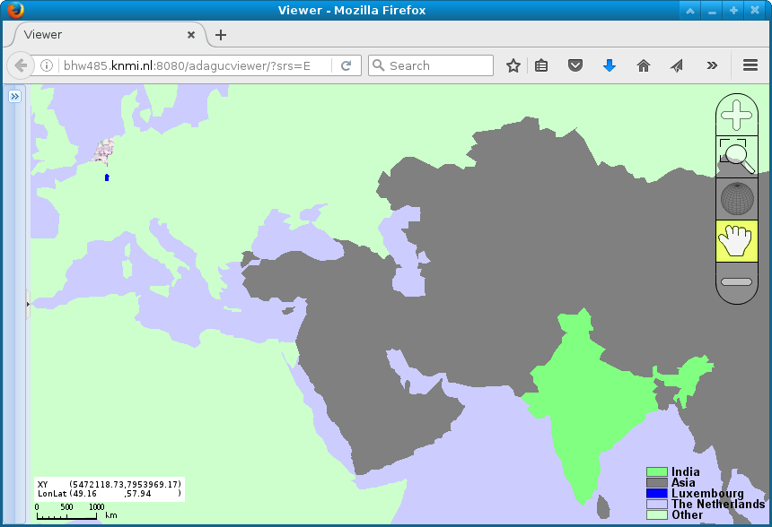
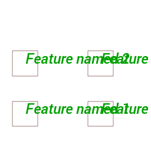

FeatureInterval (match, matchid, label, bgcolor, fillcolor)
===========================================================

Back to [Configuration](./Configuration.md)

The FeatureInterval element is used to confiure the styling of GeoJSON Features:

-   match - Required, The regular expression to match with the attribute value
-   matchid - Required, The attribute name to match with. The complete set of attributes per feature can be queried with GetFeatureInfo (click on the map in ADAGUCViewer).
-   label - Recommended, the label to display inside the legend
-   bgcolor - Optional, the background color for the map, can only be configured in the first FeatureInterval
-   fillcolor - Required, the color to shade.
-   borderwidth - Optional, the width used for drawing the border
-   bordercolor - Optional, the color used for drawing the border

It is also possible to add text labels to the displayed features. These labels can be styled with the following attributes:

-   labelfontsize - Optional, the fontsize to be used for drawing the label
-   labelfontfile - Optional, the TrueType fontfile to be used for drawing the label
-   labelcolor - Optional, the color to be used for drawing the label
-   labelproperytname- Optional, determines which GeoJSON property is used for the label
-   labelpropertyformat - Optional, determines the printf format string used to convert the labelpropertyname into a string (default %s)
-   labelangle - Optional, the angle at which the label will be drawn (in degrees), default 0 (=horizontal)
-   labelpadding - Optional, the padding in pixels to be added around the bounding boxes of labels when not plotting overlapping labels

The drawing of overlapping labels can be enabled or disabled with a [RenderSetting](./RenderSettings.md):
-   featuresoverlap - Optional, values true or false, default false. Enable or disable overlapping labels, for readability
-   randomizefeatures - Optional, values true or false, default false. Start drawing of list of labels at a random start point, so that not always the same overlapping labels are being skipped.

## Example of feature drawing:

```xml
<Style name="countries_nlmask">
    <Legend fixed="true">bluewhitered</Legend>
    <FeatureInterval match=".*" matchid="abbrev" bgcolor="#CCCCFF" fillcolor="#CCFFCCFF" label="Other"/>
    <FeatureInterval match="NLD.*" matchid="adm0_a3" fillcolor="#DFFFDF00" label="The Netherlands"/>
    <FeatureInterval match="^Luxembourg$" matchid="brk_name" fillcolor="#0000FF"  label="Luxembourg"/>
    <FeatureInterval match="^Asia$" matchid="continent" fillcolor="#808080"  label="Asia"/>
    <FeatureInterval match="^India$" matchid="abbrev" fillcolor="#80FF80"  label="India"/>
    <NameMapping name="nearest"   title="Mask NL"/>
    <RenderMethod>polygon</RenderMethod>
  </Style>

  <Layer type="database">
    <Title>Countries</Title>
    <Name>countries</Name>
    <!-- Data obtained from https://geojson-maps.kyd.com.au/ -->
    <FilePath filter="">{ADAGUC_PATH}data/datasets/countries.geojson</FilePath>
    <Variable>features</Variable>
    <Styles>countries_nlmask</Styles>
  </Layer>
```

- An example configuration is available here: [data/config/adaguc.geojson.xml](../../data/config/adaguc.geojson.xml)
- Can be used with the following GeoJSON: [data/datasets/countries.geojson](../../data/datasets/countries.geojson)




In this image, the Netherlands is transparent and can be used as a
visual mask overlay.


## Example of feature drawing with overlapping text labels in lightblue color:

```xml
<?xml version="1.0" encoding="UTF-8" ?>
<Configuration>
  <!--
  See https://dev.knmi.nl/projects/adagucserver/wiki/Dataset, for details
  This file can be included by using the adaguc.dataset.cgi?service=wms&DATASET=testdata& key value pair in the URL
  -->

 <Style name="polyline_with_label_color"  title="border 0.5px blue" abstract="border 0.5px blue">
    <RenderMethod>polyline</RenderMethod>
    <Legend fixedclasses="true" tickinterval="0.1" tickround=".01">no2</Legend>
    <FeatureInterval match=".*" bgcolor="#CCCCFF" fillcolor="#000080FF" bordercolor="#FF0000FF" label="area" borderwidth="0.5" labelpropertyname="name" labelfontsize="18" labelangle="0" labelfontfile="{ADAGUC_PATH}/data/fonts/Roboto-MediumItalic.ttf" labelcolor="#00A000FF"/>
    <RenderSettings featuresoverlap="true"/>
 </Style>

  <Layer type="database">
    <Name>areas</Name>
    <Title>Areas</Title>
    <FilePath filter="areas.geojson">{ADAGUC_PATH}data/datasets/polylinelabels</FilePath>
    <DataSource>GEOJSON</DataSource>
    <Variable>features</Variable>
    <Styles>
        polyline_with_label_color
    </Styles>
  </Layer>
</Configuration>
```
### 
- An example configuration is available here: [data/config/datasets/adaguc.testwmspolylinelabels.xml](../../data/config/datasets/adaguc.testwmspolylinelabels.xml)
- Can be used with the following GeoJSON: [data/datasets/polylinelabels/areas.geojson](../../data/datasets/polylinelabels/areas.geojson)



