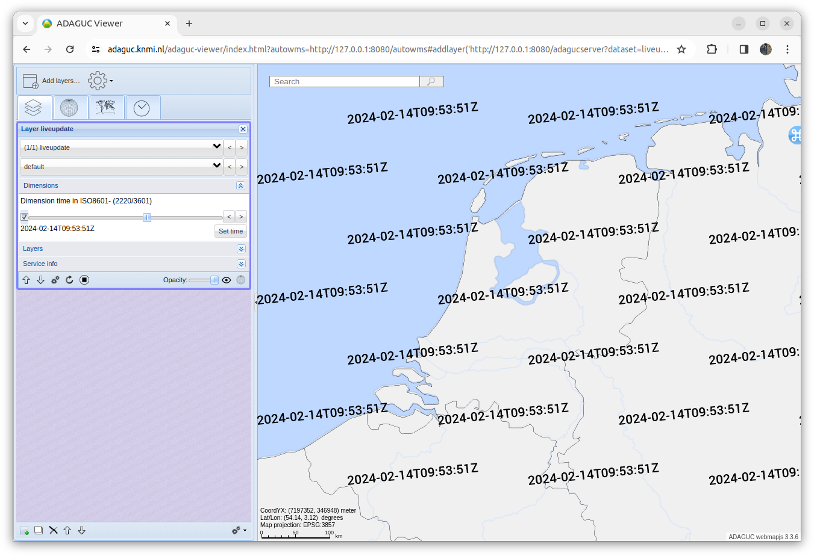
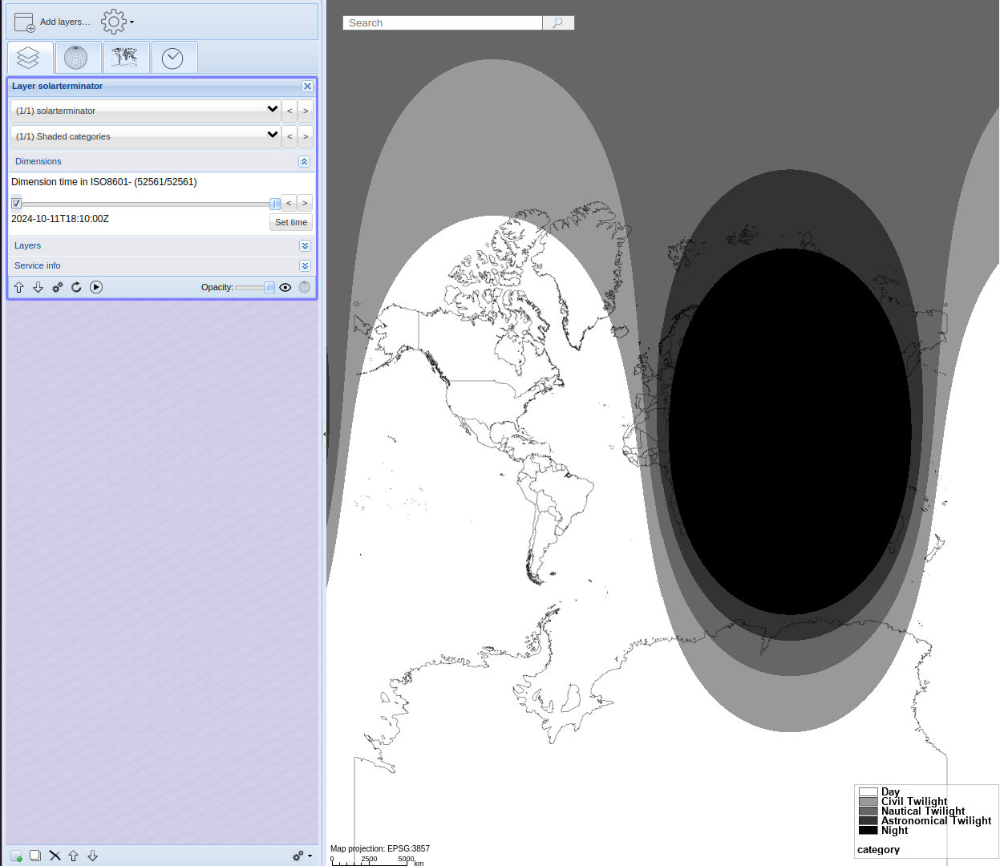

Layer (type,hidden)
===================

Back to [Configuration](./Configuration.md)

-   type - The type of layer, can be either database, grid or liveupdate
-   hidden - When set to true, the Layer is not advertised in the
    GetCapabilities document, but is accessible with GetMap requests.

Below an example of a minimum Layer configuration is given:
```xml
<Layer type="database">
  <Variable>T2m</Variable>
  <FilePath>/data/sdpkdc/har_nc/t2mtest.nc</FilePath>
  <Styles>temperature</Styles>
</Layer>
```

Grid Layers
-----------

This type of layer show a Graticule grid, displaying meridians and
parallels.
Here an example of a grid layer with a 10 degree interval is given:

```xml
<Layer type="grid">
  <Group value="baselayers"/>
  <Name force="true">grid10</Name>
  <Title>grid 10 degrees</Title>
  <Grid resolution="10"/>
  <WMSFormat name="image/png32"/>
</Layer>
```

Liveupdate layer
---------------

This layer type displays a GetMap image with the current time per second for the last hour.

```xml
<?xml version="1.0" encoding="UTF-8" ?>
<Configuration>
  <!--
  See https://dev.knmi.nl/projects/adagucserver/wiki/Dataset, for details
  This file can be included by using the adaguc.dataset.cgi?service=wms&DATASET=testdata& key value pair in the URL
  -->
  <Layer type="liveupdate">
    <Name>liveupdate</Name>
    <Dimension interval="PT1S">time</Dimension>
  </Layer>
</Configuration>
```

Note, default interval is PT10M for the liveupdate, you can overide this with the interval attribute in the dimension.



If you configure the ```solarterminator``` data postprocessor, the liveupdate layer will display a GetMap image showing the areas where it is day, night, and different twilight levels (values from 0 to 4). The solar terminator algorithm is based on the calculations presented in the book *Astronomical Algorithms* (1991) by Jean Meeus. 

More information on how to configure this type of layer can be found [here](../tutorials/Configure_solar_terminator.md).


```xml
<?xml version="1.0" encoding="UTF-8" ?>
  <!-- Shaded categories -->
  <Style name="solt_twilight" title="Twilight categories" abstract="Displays different phases of twilight and day using shades of gray, with black for night and white for day.">
    <Legend fixedclasses="true" tickinterval="0.1" tickround=".01">no2</Legend>
    <Min>0</Min>
    <Max>180</Max>
  
    <ShadeInterval min="0" max="90.0" label="Day (0–90°)" fillcolor="#FFFFFF"/>
    <ShadeInterval min="90.00" max="96.00" label="Civil Twilight (90–96°)" fillcolor="#999999"/>
    <ShadeInterval min="96.00" max="102.00" label="Nautical Twilight (96–102°)" fillcolor="#666666"/>
    <ShadeInterval min="102.00" max="108.00" label="Astronomical Twilight (102–108°)" fillcolor="#333333"/>
    <ShadeInterval min="108.00" max="180.00" label="Night (108–180°)" fillcolor="#000000"/>

    <RenderMethod>shadedcontour</RenderMethod>

  </Style>

<Configuration>
  <Layer type="liveupdate">
    <Title>Solar Zenith Angle (SZA)</Title>
    <Abstract>Displays the solar zenith angle (SZA). The SZA ranges from 0 to 90 degrees during the day, and from 90 and up to 180 degrees at night </Abstract>

    <Name>solarterminator</Name>
    <DataPostProc algorithm="solarterminator"/>
    <Variable>solarterminator</Variable>
    <Styles>solt_twilight</Styles>
    <Dimension interval="PT10M">time</Dimension>
  </Layer>
</Configuration>
```

