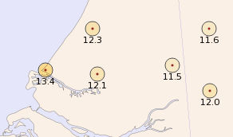
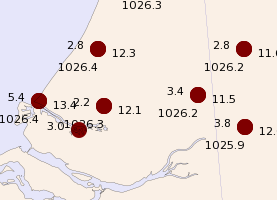
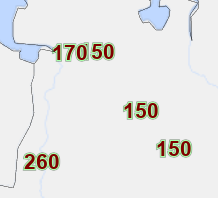
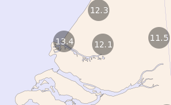
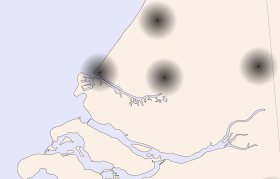
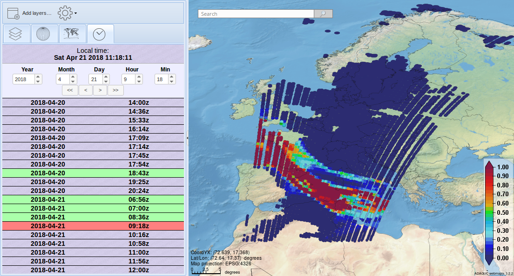
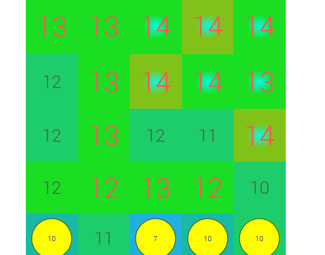

Point(min,max,pointstyle,fillcolor,linecolor,textcolor,textoutlinecolor,textformat,fontfile,fontsize,discradius,textradius,dot,anglestart,anglestep,plotstationid)
=================================================================================================================================================

Back to [Configuration](./Configuration.md)

Configuration of rendering point data
-------------------------------------

### Point attributes

| Attribute     | Type    | Default     | Description |
|---------------|---------|-------------|-------------|
| `fillcolor`     | string  | ""          | Color used for filling the point (hex like "#RRGGBB" or with alpha) |
| `linecolor`     | string  | ""          | Color used for the edge of the circle (hex like "#RRGGBB" or with alpha) |
| `pointstyle`    | string  | ""          | Required: Rendering style, e.g. "point", "disc", "volume", "symbol" or "zoomablepoint" |
| `plotstationid` | string  | "false"     | Show station id next to symbol (stored as string, e.g. "true"/"false") |
| `plotvalue`     | string  | ""          | Show numeric value next to symbol (stored as string, e.g. "true"/"false") |
| `textformat`    | string  | ""          | printf-style format used when plotvalue is enabled (e.g. "%1.0f"). |
| `min`           | double  | -DBL_MAX    | Minimum data range for rendering |
| `max`           | double  | DBL_MAX     | Maximum data range for rendering |
| `fontfile`      | string  | ""          | Font file |
| `fontsize`      | double  | 12          | Font size used when rendering text |
| `textoutlinecolor`  | string  | ""      | Outline color string |
| `textcolor`     | string  | ""          | Text color string |
| `anglestart`    | float   | -90         | Angle to plot value at
| `anglestep`     | float   | 180         | Plotted values for point are `anglestep` degrees apart from eachother
| `textradius`    | float   | 16          | Distance of text from point location
| `discradius`    | double  | 20          | Draw disc at location
| `dot`           | string  | "false"     | Draw a point at the point coordinates (stored as string, e.g. "true"/"false")
| `maxpointspercell` | int  | -1          | Filter number of points per cell. Use with `maxpointcellsize`.
| `maxpointcellsize` | int  | -1          | Filter number of poitns per cell. Use with `maxpointspercell`.

The Point element defines the rendering of point data.

A Layer with
point data can contain one or more NetCDF variables (identified by `Variable` elements in the configuration file). If there are exactly two `Variable` elements the layer is assumed to contain wind speed and direction (see [Vector](Vector.md)).

The **pointstyle** attribute defines the style of point rendering and can have one of the values `point`, `disc`, `volume`, `symbol` or
`zoomablepoint`.
Point data can be rendered:

-   as a text on the map on or around the station's location (single and multiple Variables) `point`
-   as text on a coloured disc (one Variable): `disc`
-   as a kind of fuzzy cloud: `volume`
-   as a symbol determined by the point value and a set of SymbolInterval definitions: `symbol`

The **plotstationid** attribute (true/false) defines if the stationid is
plotted together with the data.

Appearance of a text is determined by the **textcolor**, **fontfile**
and **fontsize** attributes. The numeric value is formatted into a text
by the printf-style format string of the **textformat** attribute. Tip,
no text is rendered when textformat is set to a blank space (" ").

### Pointstyle point

```xml
  <Point fillcolor="" linecolor="" textcolor="" textoutlinecolor ="" fontfile="" fontsize="" discradius="5" textradius="" textformat="%f" dot="false" anglestart="" anglestep="" plotstationid="true" pointstyle="point" />
```
This pointstyle draws a circle at the station location, coloured
according to the value of the first variable of the layer and the
Legend.

If **discradius** is defined to be larger than 0 a circle is
drawn at the station's location in a color determined by the data value
and the Style's Legend. If **discradius** is 0 then the data's value is
plotted centered at the station's location.

The attribute **linecolor** specifies a color for the edge of the
circle. Making the **linecolor** transparent (linecolor="0x00000000")
draws no line around the circle.

The value can be plotted next to the point. When 2 or more Variables are
defined in a layer, the values get plotted in a circle around the
station's location. The values are plotted starting at the angle defined
by the **anglestart** attribute and are **anglestep** degrees apart. The
distance of the text from the station's location is defined by the
**textradius** attribute.

If a **fillcolor** attribute is specified the circle is drawn in the
specified fixed color. A circle will be drawn around the disc in the
**linecolor**.

The attribute **dot** plots a dot at the station's location; this can be
useful during testing of the configuration of a point data style.

In case of plotting text only (**discradius** of 0), a **textoutlinecolor** can be set. This will draw an outline around the text in the specified color.

Single variable layer example:



Multiple variable layer example:



Text only with a **textoutlinecolor** example:



### Pointstyle disc

Pointstyle disc can only handle 1 variable in a layer or 2 in case of
wind data (direction/speed).
The attribute **discradius** defines the size of the disc on which the
value text is drawn, **fillcolor** defines the color of the disc (this
color can contain transparency).

The attributes **anglestart**, **anglestep**, **linecolor**, **textoutlinecolor**,
**plotstationid** and **textradius** have no meaning here.

Example with temperature data:



### Pointstyle volume

Pointstyle volume shows a fuzzy disc at the station's location. This
style is most useful for events that can occur often and overlap
(because the rendered discs are translucent).
The base color of the disc is defined by the **fillcolor** attribute.
A station id is plotted if the **plotstationid** attribute has the value
true.

The attributes **anglestart**, **anglestep**, **linecolor**, **textoutlinecolor** and
**textradius** have no meaning here.

Example:



### Pointstyle symbol

When set to "symbol", it enables the [SymbolInterval](SymbolInterval.md) to draw
Symbols/Icons on the map

### Pointstyle zoomablepoint

When set to "zoomablepoint", the point keeps the same size across
zooming and reprojections. This is used to plot IASI satellite imagery:

```xml
  <Style name="IASI">
    <Legend fixed="true" tickinterval=".1">temperature</Legend>
    <Min>0</Min>
    <Max>1</Max>
    <NameMapping name="point" title="IASI" abstract="IASI" />
    <Point plotstationid="false" pointstyle="zoomablepoint" textformat=" " discradius="10" textradius="0" dot="false" fontsize="8" textcolor="#000000" />
  </Style>

```



### Pointstyle radiusandvalue

This can be used to color earthquakes based on age and magnitude. In the
example below the magnitude is the radius of the disc, while the color
depends on age. The radius can be adjusted with the discradius property,
it multiplies the magnitude variable with the discradius value.

```xml
<Style name="magnitude">
  <Legend fixed="true" tickinterval="100000">magnitude</Legend>
  <Min>0</Min>
  <Max>2000000</Max>
  <NameMapping name="point" title="Richter magnitude scale" abstract="Wth continuous colors" />
  <Point min="2592000" max="1000000000000" pointstyle="radiusandvalue" textformat=" " plotstationid="false" fillcolor="#CCCCCC" discradius="2.2" textradius="0" dot="false" fontsize="14" textcolor="#FFFFFF" />
  <Point min="604800" max="2592000" pointstyle="radiusandvalue" textformat=" " plotstationid="false" fillcolor="#FFFFFFFF" discradius="2.2" textradius="0" dot="false" fontsize="14" textcolor="#FFFFFF" />
  <Point min="86400" max="604800" pointstyle="radiusandvalue" textformat=" " plotstationid="false" fillcolor="#FFFF00FF" discradius="2.2" textradius="0" dot="false" fontsize="14" textcolor="#FFFFFF" />
  <Point min="3600" max="86400" pointstyle="radiusandvalue" textformat=" " plotstationid="false" fillcolor="#FF9900FF" discradius="2.2" textradius="0" dot="false" fontsize="14" textcolor="#FFFFFF" />
  <Point min="0" max="3600" pointstyle="radiusandvalue" textformat=" " plotstationid="false" fillcolor="#FF0000" discradius="2.2" textradius="0" dot="false" fontsize="14" textcolor="#FFFFFF" />
  <LegendGraphic value="{ADAGUC_DATASET_DIR}/csv_radiusandvalue_legend.png" />
  </Style>
<Layer type="database">
  <Name>radiusandvalue</Name>
  <Title>magnitude</Title>
  <FilePath filter="">{ADAGUC_PATH}/data/datasets/test/csv_radiusandvalue.csv</FilePath>
  <Variable>age</Variable>
  <Variable>magnitude</Variable>
  <Styles>magnitude</Styles>
  <DataBaseTable>ok</DataBaseTable>
</Layer>
```


## How to render (gridded) data values as points


Render the data values from a (gridded) NetCDF file as points. Note the usage of `DataPostProc` to select the correct variable and the `Point` elements with different ranges for styling:

From [adaguc.tests.pointrendering.xml](data/config/datasets/adaguc.tests.pointrendering.xml)
```xml
  <Style name="temperature_selectpoint">
    <Legend fixed="true" tickinterval="2">wow.temperature</Legend>
    <RenderMethod>nearest</RenderMethod>
    <Min>-14</Min>
    <Max>39,33333333</Max>

    <!-- Use different disc/volume styling per range -->
    <Point min="-10" max="10" pointstyle="disc"   discradius="40" fillcolor="#ffff00" textformat=" "/>
    <Point min="13"  max="20" pointstyle="volume" discradius="25" fillcolor="#00ffff" textformat=" "/>

    <!-- Use different text color/sizes per range -->
    <Point min="-10" max="10" pointstyle="point" fontsize="10" discradius="0" textcolor="#0000ff" textformat="%0.0f" />
    <Point min="10"  max="12" pointstyle="point" fontsize="25" discradius="0" textcolor="#555555" textformat="%0.0f" />
    <Point min="12"  max="20" pointstyle="point" fontsize="40" discradius="0" textcolor="#ff5555" textformat="%0.0f" />

    <!-- Select variable air-temperature-hagl to show in points -->
    <DataPostProc algorithm="pointsfromgrid" select="air-temperature-hagl" a="20"/>
  </Style>
```


