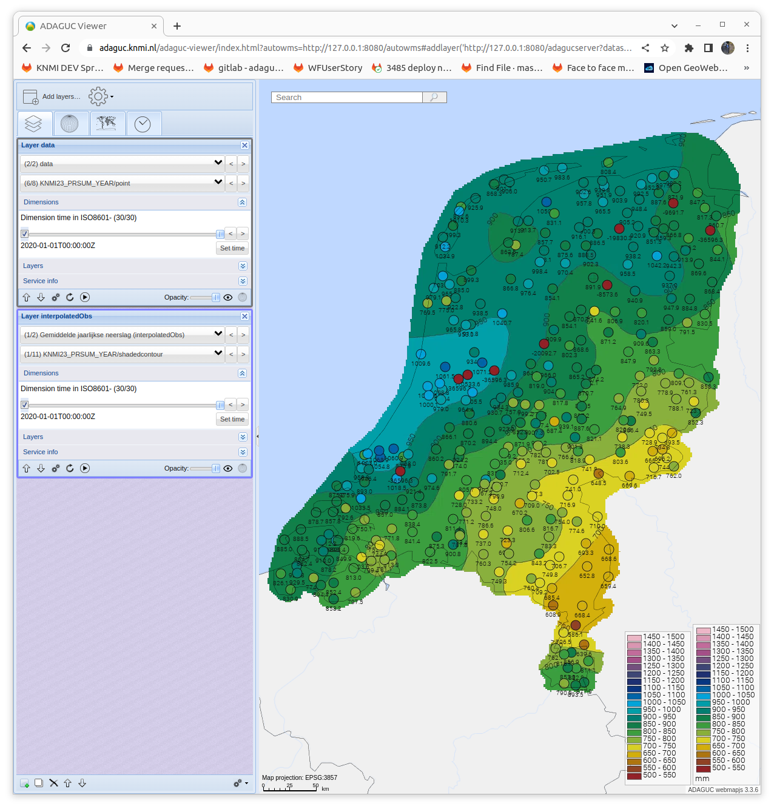

ShadeInterval (min,max,label,bgcolor,fillcolor)
===============================================

Back to [Configuration](./Configuration.md)

-   min - Value to shade from
-   max - Value to shade to
-   label - Optional, the label to display inside the legend
-   bgcolor - Optional, the background color for the map, can only be
    configured in the first Shadeinterval
-   fillcolor - Optional, the color to shade, the color picked from the
    corresponding [Legend](Legend.md). If the color does not occur in the
    legend, the nearest color is chosen. If not defined, the color is
    automatically picked from the legend.

```xml
<ShadeInterval min="0.05" max="0.25" label="0.05-0.25" fillcolor="\#E6E6FF"/>
<ShadeInterval min="0.25" max="0.50" label="0.25-0.5" fillcolor="\#B3B3FF"/>
<ShadeInterval min="0.50" max="0.75" label="0.50-0.75" fillcolor="\#8080FF"/>
<ShadeInterval min="0.75" max="1.00" label="0.75-1.00" fillcolor="\#4C4CFF"/>
```

## Pick colors from legend by using equal intervals


The following configuration can be used to make a shadeinterval between the specified min and max using the stepsize specified in `<ShadeInterval>`. 

In the example below that means (1500-500) / 50 = 20 classes. The colours will be taken from the legend.


```xml
 <Legend name="Pr_wn" type="colorRange">
    <palette index="0" color="#932226"/>
    <palette index="15" color="#944C26"/>
    <palette index="30" color="#C39301"/>
    <palette index="45" color="#ECDA1E"/>
    <palette index="60" color="#89B03B"/>
    <palette index="75" color="#279942"/>
    <palette index="90" color="#016F52"/>
    <palette index="105" color="#009E9D"/>
    <palette index="120" color="#00A5DB"/>
    <palette index="135" color="#00549D"/>
    <palette index="150" color="#122371"/>
    <palette index="165" color="#324776"/>
    <palette index="180" color="#765081"/>
    <palette index="195" color="#B24E8A"/>
    <palette index="210" color="#CB83A8"/>
    <palette index="225" color="#EEB8C5"/>
    <palette index="240" color="#EEB8C5"/>
 </Legend>
 <Style name="KNMI23_PRSUM_YEAR">
    <Legend fixedclasses="true">Pr_wn</Legend>
    <ShadeInterval>50</ShadeInterval>
    <RenderMethod>shaded,point</RenderMethod>
    <Min>500</Min>
    <Max>1500</Max>
  </Style>

```
See example with a point and a grid dataset:




