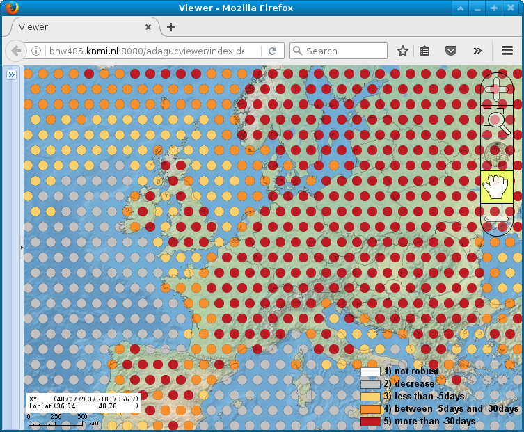

Stippling (distancex, distancey, discradius)
============================================

Back to [Configuration](./Configuration.md)

-   distancex - The X distance between the points in pixels. When set to
    zero, center of gridpoint will be used as stipple location.
-   distancey - The Y distance between the points in pixels
-   discradius - The radius of the points in pixels

Choose stippling renderer with [RenderMethod](RenderMethod.md) "stippling".

