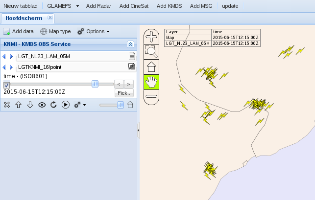
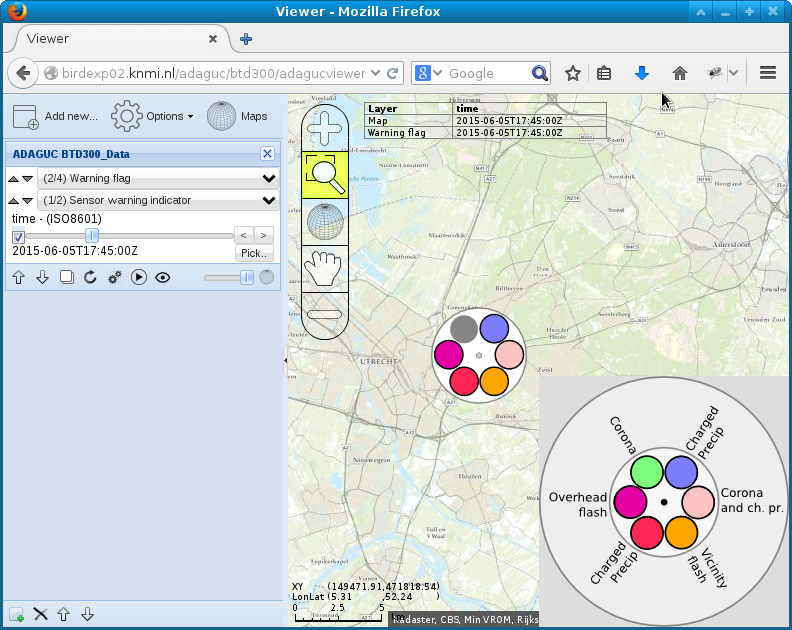
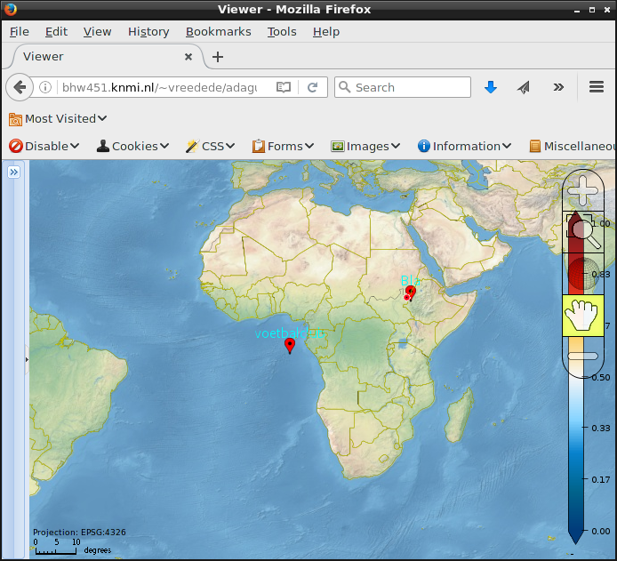

SymbolInterval(min,max,binary_and,file, offset_x, offset_y)
==============================================================

Back to [Configuration](./Configuration.md)

Draw symbols for point values
-----------------------------

The SymbolInterval element specifies a symbol file for a range of point
values.

- RenderMethod should be set to "point"

- Pointstyle "symbol" should be selected, see [Point](Point.md) for details.

- The **min** and **max** attributes specify the value range. If just
one SymbolInterval is specified and min max is not configured, all
points will be plotted as symbols.

- The **file** attribute specifies the symbol icon to be plotted at the
station's location.
- Optional settings **offset_x** and **offset_y** are used to position
the symbol, symbol is centered around 0,0

Configuration:
```xml
<Style name="LGTKNMI">
  <Legend>bluewhitered</Legend>
  <ValueRange min="1" max="4"/>
  <SymbolInterval min="1" max="2" file="/home/vreedede/nob/web/WWWRADAR/bolt1_yellow.png"/>
  <SymbolInterval min="2" max="3" file="/home/vreedede/nob/web/WWWRADAR/bolt2_yellow.png"/>
  <SymbolInterval min="3" max="4" file="/home/vreedede/nob/web/WWWRADAR/bolt1_orange.png"/>
  <SymbolInterval min="4" max="5" file="/home/vreedede/nob/web/WWWRADAR/bolt2_orange.png"/>
  <Point pointstyle="symbol" fillcolor="#000000FF" textcolor="#FFFFFFFF" linecolor="#000000A0" discradius="16" 
      dot="false" anglestart="0" anglestep="120" fontsize="12" textformat="%0.1f"/>
</Style>
```

This can be used for example for lightning data where vertical and
horizontal discharges are marked differently:



Binary_and example: Combines images based on binary operator &
---------------------------------------------------------------

```xml
<Style name="BTD300_sensor">
    <Legend>bluewhitered</Legend>
    <SymbolInterval min="0" max="63" file="/ssd1/adaguc/btd300/symbols/btdsensor/0.png"/> <!-- Base image --> 
    <SymbolInterval binary_and="1" file="/ssd1/adaguc/btd300/symbols/btdsensor/1.png"/>     <!-- combined with binary operator -->
    <SymbolInterval binary_and="2" file="/ssd1/adaguc/btd300/symbols/btdsensor/2.png"/>
    <SymbolInterval binary_and="4" file="/ssd1/adaguc/btd300/symbols/btdsensor/4.png"/>
    <SymbolInterval binary_and="8" file="/ssd1/adaguc/btd300/symbols/btdsensor/8.png"/>
    <SymbolInterval binary_and="16" file="/ssd1/adaguc/btd300/symbols/btdsensor/16.png"/>
    <SymbolInterval binary_and="32" file="/ssd1/adaguc/btd300/symbols/btdsensor/32.png"/>
    <Point pointstyle="symbol" fillcolor="#000000FF" textcolor="#FFFFFFFF" linecolor="#000000A0" discradius="16" 
         dot="false" anglestart="0" anglestep="120" fontsize="12" textformat="%0.1f"/>
    <NameMapping name="point"   title="Sensor warning indicator" abstract="Draw status of BTD sensor with flash detections"/>
    <LegendGraphic value="/ssd1/adaguc/btd300/symbols/btd300legend.png"/>
  </Style>
```



Draw symbols as marker
----------------------

Sometimes one wants to draw a marker if there is any data available for
a point. for example, to draw a Google maps like marker for every
station that has a name.
This can be done by selecting pointstyle symbol and specifying exactly
one SymbolInterval without min and max attributes.
The offset_x and offset_y can be used to offset the image around the
plot coordinate.
The attribute plotstationid (true/false) determines if the station name
will be plotted above the point.

An example are the use of markers like .

This would look like:


```xml
<Style name="marker">
  <Legend>bluewhitered</Legend>
  <SymbolInterval file="/home/vreedede/adaguc/marker.png" offset_x="0" offset_y="-8"/>
  <Point pointstyle="symbol" fillcolor="#000000FF" textcolor="#FFFFFFFF" linecolor="#000000A0" discradius="16" 
      dot="false" anglestart="0" anglestep="120" fontsize="12" textformat="%0.1f" plotstationid="true" />
</Style>
```
