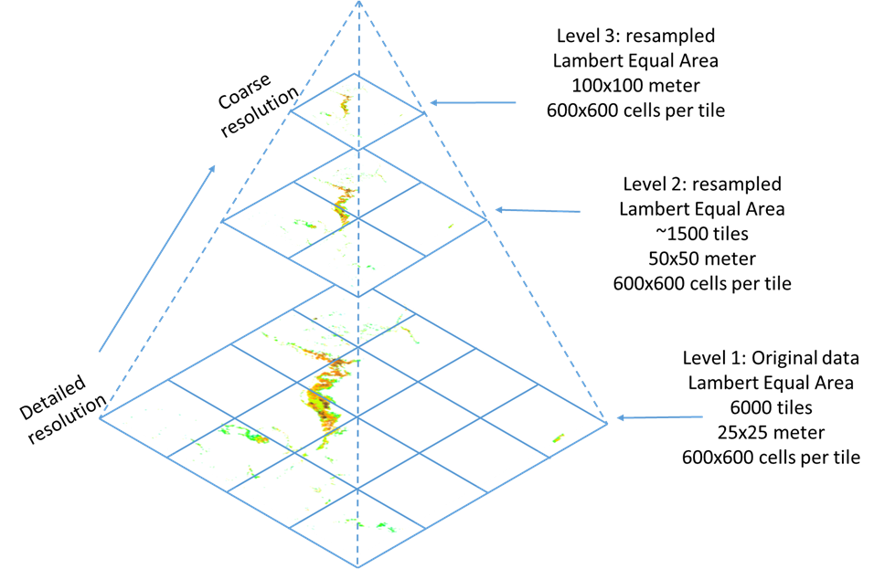

TileSettings - Tiling functionality for high resolution datasets
================================================================

Back to [Configuration](./Configuration.md)


-   tilewidthpx - width of the tiles, defaults to 1024
-   tileheightpx - height of the tiles, defaults to 1024
-   minlevel - starting level, should always be 1, defaults to 1
-   maxlevel - end level, defaults to 3.
-   debug="false" - draw information in the GetMap request about what tiles are used. Defaults to false.
-   maxtilesinimage="16" - defaults to 16.
-   tilepath="/data/adaguc-autowms/tiles" - Defaults to the same place as the source data.
-   autotile - Can be either `false`, `true` or `file`. `true` means that new tiles will be made for any type of scan, including full dataset scans. `file` means that tiles will only be made for files scanned specifically. 


By using tiling, big satellite imagery datasets can be tiled on the server to increase response time of the GetMap request.
The tiling option can be enabled via the `TileSettings` configuration element. When autotile is enabled, new tiles will be made when spefic files are added with the scan script. If no tiles are made (yet), the server will directly use the non-tiled data.

For the client there is no difference. The server will stitch the tiles together to a single image. The tiles are stored in the netCDF file format with compression enabled. The suffix of the tiles is `<sourcefilename>tile.nc`.


*Note*: The tiles are by default put in the same place as the source data. In this case, the filter in the FilePath element needs to be configured in such a way so it includes the tiles. E.g. use  `(\.png|tile\.nc)` in your filter.


Example configuration for MTG-FCI-FD_eur_atlantic_1km_true_color product:

```xml

<?xml version="1.0" encoding="UTF-8"?>
<Configuration>
  <WMS>
    <WMSFormat name="image/png" format="image/webp;75" />
  </WMS>
  <Layer type="database">
    <Group value="MTG FCI composites" />
    <Name force="true">MTG-FCI-FD_eur_atlantic_1km_true_color</Name>
    <Title>MTG True Colour RGB Atlantic day-only </Title>
    <Variable>pngdata</Variable>
    <FilePath filter="^MTG-FCI-FD_eur_atlantic_1km_true_color_.*(\.png|tile\.nc)$"
       retentionperiod="{ADAGUCENV_RETENTIONPERIOD}"
       retentiontype="datatime">/data/adaguc-data/MTG-FCI-FD_eur_atlantic_1km_true_color/</FilePath>
    <Dimension name="time" interval="PT10M">time</Dimension>
    <RenderMethod>rgba</RenderMethod>
    <TileSettings debug="false" autotile="file" />
  </Layer>
</Configuration>

```


Some datasets in CLIPC are in such a high resolution that they cannot be
stored in a single file. For example the flooding indicator from
CLIPC/PIK is at 25 meter resolution along the coast in Europe. The data
is organized in 6000 different NetCDF files, each covering its own area
in 600x600 grid cells, which need to be “stitched” together. This can be
compared with composing a large panoramic picture from multiple pictures
taken along the horizon. The challenge here is to provide interactive
visualization at several cartographic projections and zoom levels.

To achieve this, ADAGUC has been extended to allow building image
pyramids at several zoom levels on coarser resolutions (see Figure ).
For CLIPC 7 different pyramid levels are used for the flooding
indicator, the top level consists of three tiles, the bottom level of
6000 tiles. When zooming to a specific distortion of the map, the level
with the best matching resolution is used to render the requested image.
That means that ADAGUC projects and combines several tiles into a single
image suitable for WMS. This type of tiled datasets in ADAGUC behave
like any other WMS, e.g. interactive zooming and panning at several
cartographic map projections remain possible.For CLIPC the flooding
indicator in the cartographic projection lambert equal area is remapped
on request to the Mercator projection used in the CLIPC portal.


