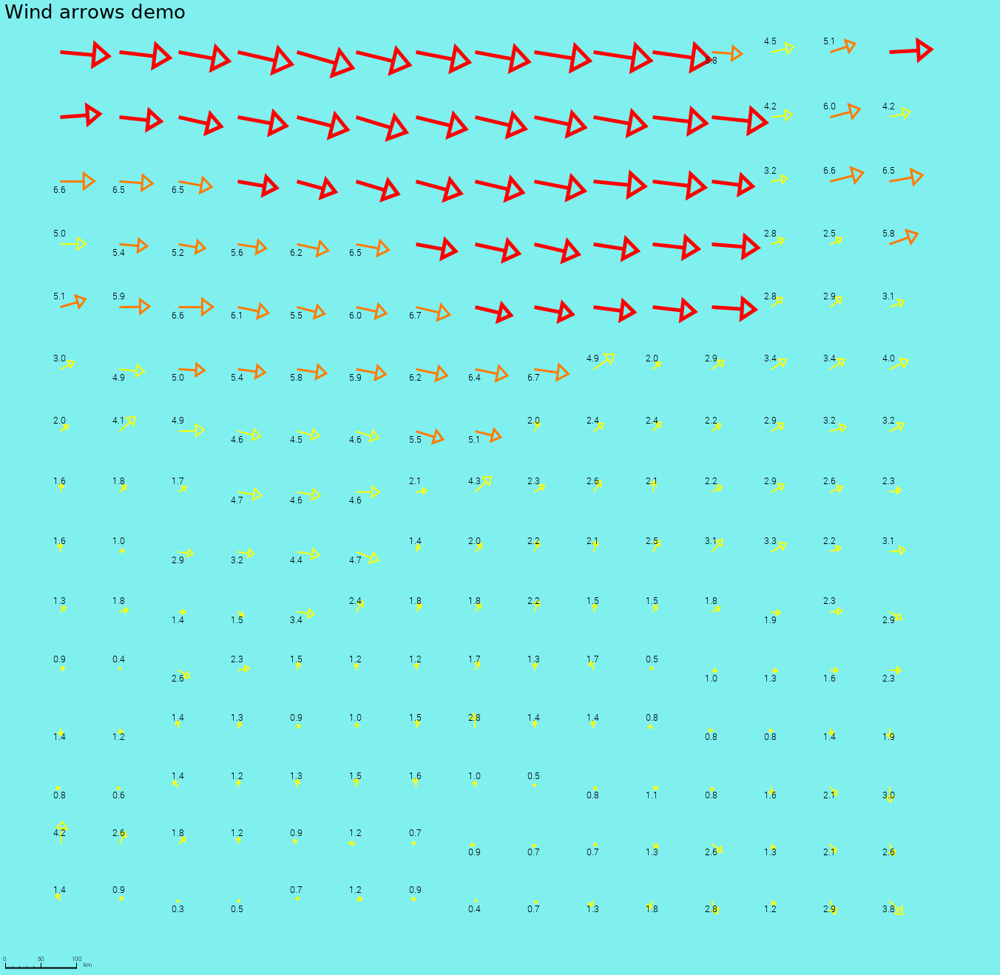
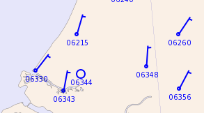

Vector (linecolor, linewidth,scale,vectorstyle,plotstationid,plotvalue,textformat, min, max, fontsize, outlinewidth, outlinecolor, textcolor, dot)
==================================================================================

Back to [Configuration](./Configuration.md)

Configuration of rendering vector point data
--------------------------------------------

Vector or windbarbs are rendered via adagucserverEC/CConvertADAGUCPoint.cpp

### Vector attributes

Purpose: holds configuration attributes for rendering vector/point (wind) symbols.

| Attribute     | Type    | Default     | Description |
|---------------|---------|-------------|-------------|
| `fillcolor`   | string  | ""          | Color used for filling the point (hex like "#RRGGBB" or with alpha) |
| `linecolor`   | string  | ""          | Color used for the vector/barb/disc (hex like "#RRGGBB" or with alpha) |
| `linewidth`   | double  | 1.0         | Line width for vector or barb |
| `scale`       | float   | 1.0         | Only for vector style: scale factor to convert speed to drawn length |
| `vectorstyle` | string  | ""          | Required: Rendering style, e.g. "disc", "vector", "barb" |
| `plotstationid` | string| "false"     | Show station id next to symbol (stored as string, e.g. "true"/"false") |
| `plotvalue`   | string  | ""          | Show numeric value next to symbol (stored as string, e.g. "true"/"false") |
| `textformat`  | string  | ""          | printf-style format used when plotvalue is enabled (e.g. "%1.0f") |
| `min`         | double  | -DBL_MAX    | Minimum data range for rendering |
| `max`         | double  | DBL_MAX     | Maximum data range for rendering |
| `fontfile`    | string  | ""          | Font file |
| `fontsize`    | double  | 12          | Font size used when rendering text |
| `outlinewidth`| double  | 4.5         | Outline stroke width around text/symbols |
| `outlinecolor`| string  | ""          | Outline color string |
| `textcolor`   | string  | ""          | Text color string |
| `discradius`  | double  | 20          | Draw disc at location
| `dot`         | string  | "false"     | Draw a point at the point coordinates (stored as string, e.g. "true"/"false")


Please check the examples in [data/config/datasets/adaguc.tests.vectorrendering.xml](../../data/config/datasets/adaguc.tests.vectorrendering.xml)

## How to render windbarbs from point data, like CSV, NetCDF or GeoJSON

Example with same style for all:

```xml
  <Style name="windbarbs_kts_shaded_withbarbs_for_points">
    <Vector vectorstyle="barb" linecolor="#0000FF"  plotvalue="true" />
  </Style>
```


Example with different styling options:

```xml
  <Style name="windbarbs_kts_shaded_withbarbs_for_points_differentoptions">
    <Vector max="1" vectorstyle="barb" outlinewidth="5"  linewidth="2" outlinecolor="#000000ff" linecolor="#00FF00"  plotvalue="false" />
    <Vector min="1" max="10" vectorstyle="barb" linecolor="#0000FF"  plotvalue="true" />
    <Vector min="10" max="15" vectorstyle="barb" outlinewidth="0" linewidth="3" linecolor="#000000" plotvalue="true" textcolor="#111111"/>
    <Vector min="15" vectorstyle="barb" outlinewidth="15" outlinecolor="#FFFFFF" linewidth="1" linecolor="#FF1111" plotvalue="false" textcolor="#FF1111"/>
  </Style>
```


If points are close to each other, you can specify 

```xml
<Thinning radius="40"/>
```
in your style to reduce the overlapping points. A distance of 40 pixels will be used in this case.

## How to render windbarbs from grids, like gridded NetCDF data

Please check Also check the examples in [data/config/datasets/adaguc.tests.vectorrendering.xml](../../data/config/datasets/adaguc.tests.vectorrendering.xml)

```xml
<Style name="windbarbs_kts_shaded_withbarbs_for_grids">
  <ShadeInterval min="0" max="0.3"     label=" 0  [  &lt; 0 kts] (&lt; 0.3 m/s)" fillcolor="#9600fe"/>
  <ShadeInterval min="0.3" max="1.6"   label=" 1  [  1-3 kts  ] (0.3-1.6 m/s)" fillcolor="#9600fe"/>
  <ShadeInterval min="1.6" max="3.4"   label=" 2  [  4-6 kts  ] (1.6-3.4 m/s)" fillcolor="#0064fe"/>
  <ShadeInterval min="3.4" max="5.5"   label=" 3  [  7-10 kts ] (3.4-5.5 m/s)" fillcolor="#00c8fe"/>
  <ShadeInterval min="5.5" max="8.0"   label=" 4  [ 11-16 kts ] (5.5-8.0 m/s)" fillcolor="#25c192"/>
  <ShadeInterval min="8.0" max="10.8"  label=" 5  [ 17-21 kts ] (8.0-10.8 m/s)" fillcolor="#00e600"/>
  <ShadeInterval min="10.8" max="13.9" label=" 6  [ 22-27 kts ] (10.8-13.9 m/s)" fillcolor="#00fa00"/>
  <ShadeInterval min="13.9" max="17.2" label=" 7  [ 28-33 kts ] (13.9-17.2 m/s)" fillcolor="#feae00"/>
  <ShadeInterval min="17.2" max="20.8" label=" 8  [ 34-40 kts ] (17.2-20.8 m/s)" fillcolor="#b40032"/>
  <ShadeInterval min="20.8" max="24.5" label=" 9  [ 41-47 kts ] (20.8-24.5 m/s)" fillcolor="#fE0096"/>
  <ShadeInterval min="24.5" max="200"  label="10 [  &gt;48 kts ] (&gt;24.5 m/s)" fillcolor="#420027"/>

  <Vector  min="0" max="1"     vectorstyle="barb" linewidth="2" linecolor="#FFFFFF" plotvalue="false" outlinewidth="1.6" outlinecolor="#000000" />
  <Vector min="1" max="3.4"      vectorstyle="barb" linewidth="0" linecolor="#000000" plotvalue="true" />
  <Vector min="3.4" max="8"      vectorstyle="barb" linewidth="3" linecolor="#FFFF00" plotvalue="true" />
  <Vector min="8" max="10.8"     vectorstyle="barb" linewidth="1.5" outlinewidth="4" fontsize="15" outlinecolor="#000000"  linecolor="#FFFFFF" plotvalue="true" textcolor="#FFFFFF" />
  <Vector min="10.8" max="13.9"  vectorstyle="barb" linewidth="0" linecolor="#00FF00" plotvalue="true" textcolor="#111111"/>
  <Vector min="13.9"             vectorstyle="barb" linewidth="0" linecolor="#00FF00" plotvalue="true" textcolor="#111111"/>

  <RenderSettings renderhint="discreteclasses" />
  <!--
    Extracts point from a grid and makes them available for the point renderer
    - select: Which data objects to sample from the Layer
    - a: Optionally apply thinning in pixels, points will be no closer than a pixels in the GetMap response.
  -->
  <DataPostProc algorithm="pointsfromgrid" select="speed_component,direction_component" a="50"/>
  <!--
    Use nearest renderer and point renderer to render the windbarbs
    - nearest will render the grid via adagucserverEC/CImgWarpNearestNeighbour
  -->
  <RenderMethod>nearest</RenderMethod>
</Style>
```


## Render wind discs


For discs the options are currently limited to linewidth, textcolor and fontsize:

```xml
  <Style name="winddiscs_for_grids">
    <Vector vectorstyle="disc" linewidth="1" textcolor="#FFFFFF" fontsize="9" />
    <DataPostProc algorithm="pointsfromgrid" select="speed_component,direction_component" a="50"/>
  </Style>

```


## Render wind arrows

```xml
  <Style name="windarrows_for_grids">
    <Vector max="5" vectorstyle="vector" linewidth="2"  linecolor="#FFFF00"  scale="7" plotvalue="true" textcolor="#000000"/>
    <Vector min="5" max="7" vectorstyle="vector" linewidth="3" linecolor="#ff7b00ff" scale="7"  plotvalue="true" textcolor="#000000" />
    <Vector min="7" vectorstyle="vector" linewidth="5" linecolor="#FF0000" scale="7" />
    <DataPostProc algorithm="pointsfromgrid" select="speed_component,direction_component" a="50"/>
  </Style>

```




## Other examples:

```xml
 <Style name="bftalldiscvec">
    <Legend fixed="true">bluewhitered</Legend>
    <Min>0</Min>
    <Max>10000</Max>
    <Thinning radius="40"/>
    <RenderMethod>barb,barbthin</RenderMethod>
    <Point pointstyle="point" fillcolor="#00000060" textcolor="#FFFFFFFF" linecolor="#00000060" discradius="20" dot="true" anglestart="0" anglestep="120" fontsize="10" textformat="%1.0f"/>
    <Vector vectorstyle="disc" linewidth="1.0" linecolor="#00FF00FF"/>
 </Style>
```

### Example of wind as an arrow:


### Example of wind as a barb:



### Example of wind as a disc:


