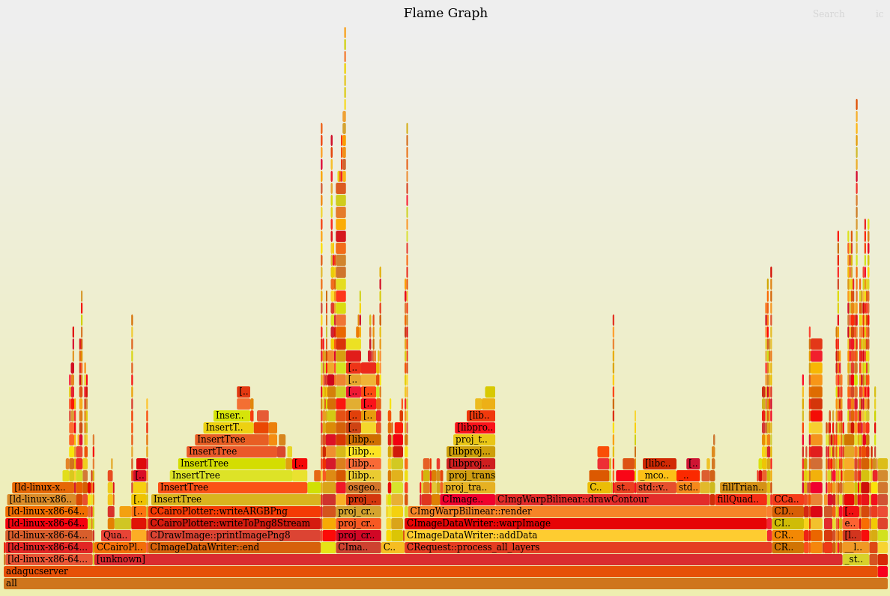
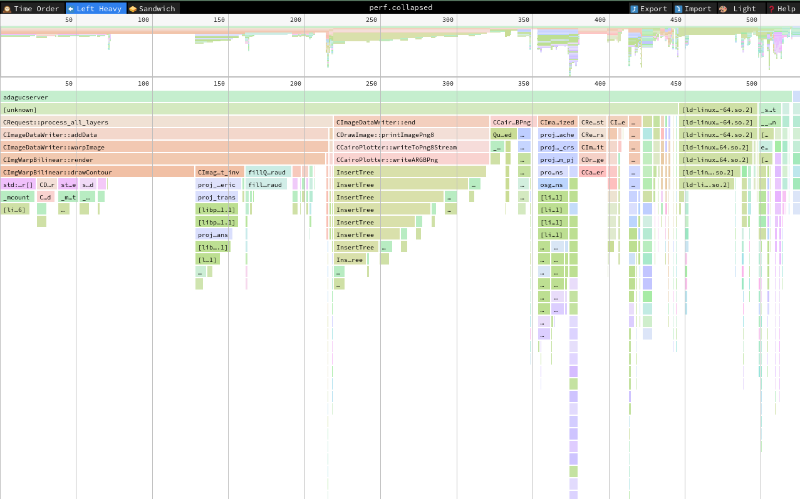
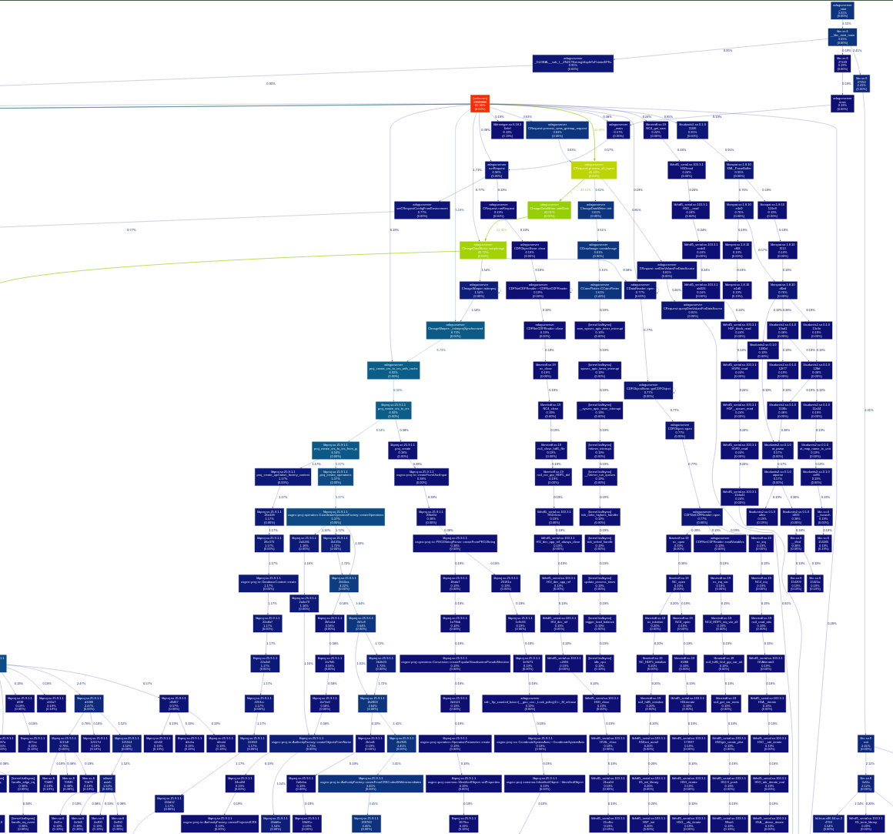

# Profiling Adaguc-server

This page describes how to use [linux perf](https://en.wikipedia.org/wiki/Perf_%28Linux%29) to profile `adagucserver`. `perf` records events that can be used to generate a [flamegraph](https://github.com/brendangregg/FlameGraph) or [callgraph](https://github.com/jrfonseca/gprof2dot).

These instructions are tested on a physical x86_64 Linux machine, and adaguc-server is executed from within a docker container using the `docker compose` setup.

These instructions are not tested when running Adaguc in a cloud environment.

## Generate binary with debug symbols

Edit `CMakeLists.txt` to add the following compiler flags: `-g -p -fno-omit-frame-pointer`.

This works:
```txt
  set(CMAKE_CXX_FLAGS_DEBUG "-ggdb -Wall -Wextra -g3 -p -fno-omit-frame-pointer")
  set(CMAKE_CXX_FLAGS_RELEASE "-ggdb -Wall -Wextra -g3 -p -fno-omit-frame-pointer")
```

## Docker changes

To allow the (root) user to capture linux perf events, you need to add the `SYS_ADMIN` capability to `docker-compose.yml`.

You also need to use your locally compiled adaguc image that contains debug symbols.

To do this, edit `./Docker/docker-compose.yml` and modify it like below:

```yml
  adaguc-server:
    cap_add:
      - SYS_ADMIN
    # image: openearth/adaguc-server
    build: ..
```

Then restart the containers:

```bash
cd ./Docker/
docker compose down
docker compose up -d --build
```

After adaguc-server is running again, `exec` in the container as root:

```bash
docker exec -u0 --privileged -it my-adaguc-server /bin/bash
```

The next steps will be performed as root from within the adaguc-server container.

## Setup environment

Install `linux-perf`, which will provide the tool `perf`:
```bash
apt update; apt install -y linux-perf
```

Setup environment variables for adaguc:
```bash
export ADAGUC_TMP=/tmp
export ADAGUC_CONFIG=/adaguc/adaguc-server-config.xml
```

The goal is to profile the C++ application which resides in `./bin/adagucserver`. The binary `adagucserver` normally gets spawned by the python webserver, and the binary exits as fast as possible.

To be able to profile `adagucserver`, we can spawn it through `perf` instead of through the python webserver.
This requires us to set the `QUERY_STRING` environment variable, so we can profile the request that we want (e.g. WMS GetMap).

You can use [adaguc-viewer](https://adaguc.knmi.nl/adaguc-viewer/index.html), open your browser's developer tools network tab, perform the request you want to profile, and copy the URL parameters of your request. Set the `QUERY_STRING` to these URL parameters. For example:

```bash
export QUERY_STRING="DATASET=mydataset&SERVICE=WMS&VERSION=1.3.0&REQUEST=GetMap&LAYERS=air-temperature-hagl&WIDTH=1008&HEIGHT=995&CRS=EPSG%3a3857&BBOX=-7470893.149487414,703507.8780614401,-5525657.400627586,2623656.26111256&STYLES=temperature%2fshadedcontour&FORMAT=image/png&TRANSPARENT=TRUE&time=2023-01-26T00%3a00%3a00Z&DIM_forecast_reference_time=2023-01-24T00%3a00%3a00Z&DIM_temp_at_hagl=2"
```

If you execute `adagucserver` manually, it will write the (binary) response to the terminal. You can use this to verify if this is the request you want.
```bash
./bin/adagucserver
```

## Profile

The following command will sample `./bin/adagucserver` with 1000 Hz, try to generate a callgraph in the "dwarf" format, and store the result in `perf.out`:

```bash
perf record -o perf.out -F1000 -g --call-graph dwarf ./bin/adagucserver
```


You need to "post process" the outputted file. This step needs to happen inside the docker container as well:
```bash
perf script -i perf.out | c++filt > perf.data
```

Profiling is done!

The next section is about visualizing the recorded data. This can be done on your host system (non-root). Make sure to copy your generated profile data by running the following command from the host OS:
```bash
docker cp my-adaguc-server:/adaguc/adaguc-server-master/perf.data ./
```

### Optional profiling info
- You can run `perf report -i perf.out` inside the container which opens a TUI in which you can explore the perf report.

- The `perf record` command supports multiple options. For completeness, the following commands can generate different variants of perf data:
```
perf record -o perf.out -F1000 -g ./bin/adagucserver
perf record -o perf.out -F1000 -g --call-graph fp ./bin/adagucserver
```

## Visualize

### Flamegraph

Install FlameGraph tools from github:

```bash
git clone https://github.com/brendangregg/FlameGraph 
```

Raw profile data needs to be "collapsed", and can then be transformed to a flamegraph. The flamegraph is an interactive .svg file. View this svg file using your favorite `$BROWSER`.

Assuming you installed the `FlameGraph` repo in `~/src`, you can run the following commands to generate a flamegraph:

```bash
cat perf.data | ~/src/FlameGraph/stackcollapse-perf.pl | ~/src/FlameGraph/flamegraph.pl > perf.svg
firefox perf.svg
```



The "collapsed" data can also be viewed in an interactive tool, e.g. [speedscope](https://www.speedscope.app):
```bash
cat perf.data | ~/src/FlameGraph/stackcollapse-perf.pl > perf.collapsed
firefox https://www.speedscope.app
```

Then drag the `perf.collapsed` file in your browser to see something like this:



### Callgraph

It is possible to visualize the perf data as a callgraph.

It seems the results are not always as useful (broken/unclear graphs). For completeness, this is how you can generate callgraphs.

Install `graphviz` and `gprof2dot` dependencies. On Ubuntu/Debian-likes:

```bash
apt install graphviz
pip install gprof2dot
```

Generate callgraph and view in your browser:
```bash
cat perf.data | gprof2dot.py -f perf --skew=0.1 -e0 -n0 | dot -Tsvg -o callgraph.svg
firefox callgraph.svg
```
This generates a massive graph. Zoomed out it looks a little bit like this (this is about 1/4th of the diagram):


