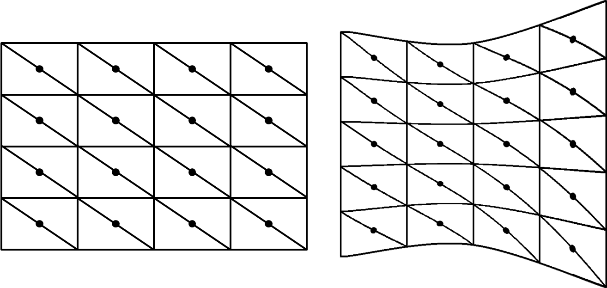
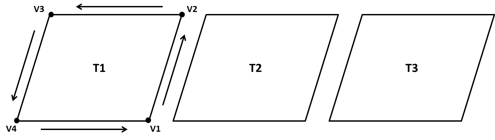

# Generic file structure

# Supported data types

## Grid based data
Grid data is defined as a data grid with rectangular pixels with constant X and Y dimensions over time.
The pixels should be rectangular either in the geographic coordinate system (latitude and longitude)
or in a projected coordinate system.

[Detailed grid format description](data_format_standard_grid.md)

## Vector based data
Vector data is defined as a data polygon described by 4 points (a tile) per time step.

[Detailed vector format description](data_format_standard_vector.md)

## Point based data
[Detailed point format description](data_format_standard_point.md)

