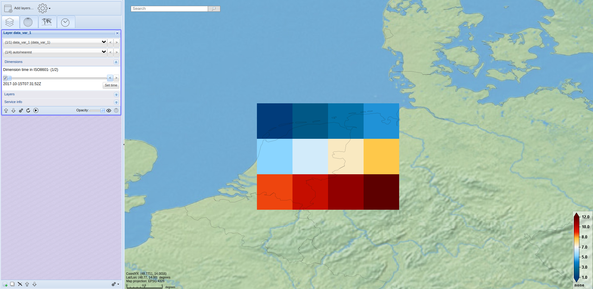
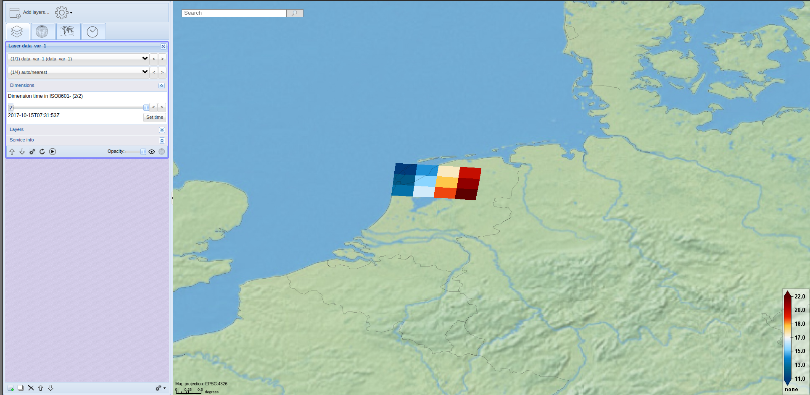

## NetCDF file example geographic coordinate system
[Script to generate NetCDF file](https://github.com/KNMI/adaguc-server/blob/master/data/python/format_standard/generate_example_file_grid_format_lat_lon.py)

``` 
dimensions:
    lon = 4 ;
    lat = 3 ;
    time = 2 ; 
variables:
    float lon(lon) ;
        lon:standard_name = "longitude" ;
        lon:long_name = "longitude" ;
        lon:units = "degrees_east" ;
    float lat(lat) ;
        lat:standard_name = "latitude" ;
        lat:long_name = "latitude" ;
        lat:units = "degrees_north" ;
    double time(time) ;
        time:standard_name = "time" ;
        time:long_name = "time" ;
        time:units = "seconds since 1970-01-01 00:00:00" ;
    double data_var_1(time, lat, lon) ;
        data_var_1:standard_name = "Standard name of data variable 1" ;
        data_var_1:long_name = "Long name of data variable 1" ;
        data_var_1:units = "Units of data variable 1" ;
data:
 lon = 5.05, 6.05, 7.05, 8.05;
 
 lat = 53.5, 52.5, 51.5;
 
 time = 1508052712, 1508052713 ;
  
 data_var_1 =
  1, 2, 3, 4,
  5, 6, 7, 8,
  9, 10, 11, 12,
  11, 12, 13, 14,
  15, 16, 17, 18,
  19, 20, 21, 22 ;

 
```

### Resulting image



## NetCDF file example with projection
[Script to generate NetCDF file](https://github.com/KNMI/adaguc-server/blob/master/data/python/format_standard/generate_example_file_grid_format_proj.py)

``` 
dimensions:
    x = 4 ;
    y = 3 ;
    time = 2 ; 
variables:
    float x(x) ;
        lon:standard_name = "x coordinate of projection" ;
        lon:long_name = "projection_x_coordinate" ;
        lon:units = "km" ;
    float y(y) ;
        lat:standard_name = "y coordinate of projection" ;
        lat:long_name = "projection_y_coordinate" ;
        lat:units = "km" ;
    double time(time) ;
        time:standard_name = "time" ;
        time:long_name = "time" ;
        time:units = "seconds since 1970-01-01 00:00:00" ;
    double data_var_1(time, lat, lon) ;
        data_var_1:standard_name = "Standard name of data variable 1" ;
        data_var_1:long_name = "Long name of data variable 1" ;
        data_var_1:units = "Units of data variable 1" ;
        data_var_1:grid_mapping = "projection" ;
    char projection ;
        projection:EPSG_code = "none" ;
        projection:grid_mapping_name = "polar_stereographic" ;
        projection:latitude_of_projection_origin = 90. ;
        projection:straight_vertical_longitude_from_pole = 0. ;
        projection:scale_factor_at_projection_origin = 0.933012709177451 ;
        projection:false_easting = 0. ;
        projection:false_northing = 0. ;
        projection:semi_major_axis = 6378140. ;
        projection:semi_minor_axis = 6356750. ;
        projection:proj4_params = "+proj=stere +lat_0=90 +lon_0=0 +lat_ts=60 +a=6378.14 +b=6356.75 +x_0=0 y_0=0" ;
        projection:long_name = "projection" ;
    
data:
 x = 340, 370, 400, 430 ;

 y = -3950, -3980, -4000 ;
 
 time = 1508052712, 1508052713 ;
  
 data_var_1 =
  1, 2, 3, 4,
  5, 6, 7, 8,
  9, 10, 11, 12,
  11, 12, 13, 14,
  15, 16, 17, 18,
  19, 20, 21, 22 ;
  
  projection = "" ;

 
```

### Resulting image
