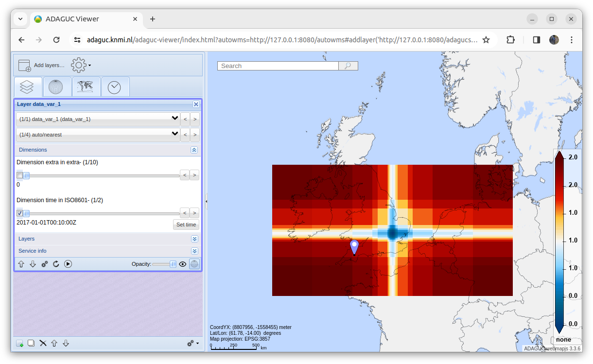

# Example format

[Back](./README.md)

This script will create a file where lon and lat variables have irregular spacing. These variables are still 1 dimensional.

[Script to generate NetCDF file](../../python/format_standard/generate_example_file_irregular_1Dlat1Dlon_grid.py)

## NetCDF file
``` 
netcdf example_file_irregular_1Dlat1Dlon_grid {
dimensions:
        time = 2 ;
        lat = 16 ;
        lon = 20 ;
        extra = 10 ;
variables:
        double time(time) ;
                time:standard_name = "time" ;
                time:long_name = "time" ;
                time:units = "seconds since 1970-01-01 00:00:00" ;
        double lon(lon) ;
                lon:standard_name = "longitude" ;
                lon:long_name = "longitude" ;
                lon:units = "degrees_east" ;
        double lat(lat) ;
                lat:standard_name = "latitude" ;
                lat:long_name = "latitude" ;
                lat:units = "degrees_north" ;
        double extra(extra) ;
                extra:standard_name = "extra" ;
                extra:long_name = "extra" ;
                extra:units = "extra" ;
        float data_var_1(extra, time, lat, lon) ;
                data_var_1:_FillValue = -9999.f ;
                data_var_1:least_significant_digit = 3LL ;
                data_var_1:standard_name = "data_var_1" ;
                data_var_1:long_name = "data_var_1" ;
                data_var_1:units = "none" ;
data:

 time = 1483229400, 1483229460 ;

 lon = -12, -8, -4, -2, -1.5, -0.5, -0.4, -0.3, -0.2, -0.1, 0, 0.1, 0.2, 0.3, 
    0.5, 1.5, 2, 4, 8, 12 ;

 lat = 48, 50, 50.5, 51.5, 51.6, 51.7, 51.8, 51.9, 52, 52.1, 52.2, 52.3, 
    52.5, 53.5, 54, 56 ;

 extra = 0, 0.1, 0.2, 0.3, 0.4, 0.5, 0.6, 0.7, 0.8, 0.9 ;
}

 
```

### Resulting image

