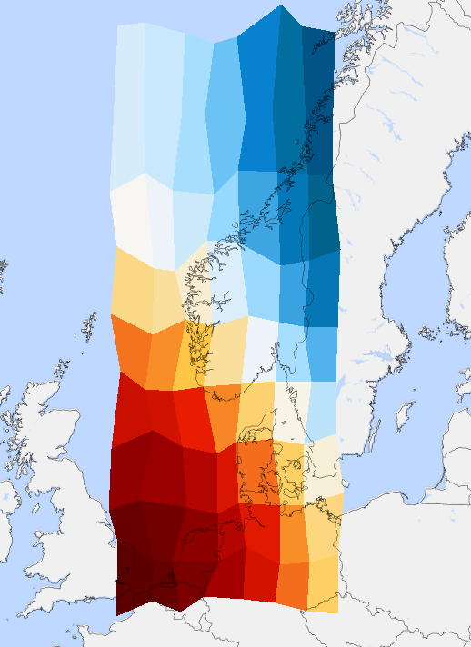

# Example format

[Back](./README.md)

This script will create a file where lon and lat variables have irregular spacing. These lat/lon dimension variables are 2 dimensional and irregular

[Script to generate NetCDF file](../../python/format_standard/generate_example_file_irregular_2Dlat2Dlon_grid.py)

## NetCDF file
``` 
etcdf example_file_irregular_2Dlat2Dlon_grid {
dimensions:
	time = 2 ;
	x = 8 ;
	y = 10 ;
	extra = 10 ;
variables:
	double time(time) ;
		time:standard_name = "time" ;
		time:long_name = "time" ;
		time:units = "seconds since 1970-01-01 00:00:00" ;
	double lon(y, x) ;
		lon:_FillValue = -9999. ;
		lon:standard_name = "longitude" ;
		lon:long_name = "longitude" ;
		lon:units = "degrees_east" ;
	double lat(y, x) ;
		lat:_FillValue = -9999. ;
		lat:standard_name = "latitude" ;
		lat:long_name = "latitude" ;
		lat:units = "degrees_north" ;
	double extra(extra) ;
		extra:standard_name = "extra" ;
		extra:long_name = "extra" ;
		extra:units = "extra" ;
	float data_var_1(extra, time, y, x) ;
		data_var_1:_FillValue = -9999.f ;
		data_var_1:least_significant_digit = 3LL ;
		data_var_1:standard_name = "data_var_1" ;
		data_var_1:long_name = "data_var_1" ;
		data_var_1:units = "none" ;
data:

 time = 1483229400, 1483229460 ;

 lon =
  0.17794546007564, 2.76480838102692, 4.18878554126185, 6.13140594851911, 
    8.25776443616664, 10.594877870279, 12.6994494223276, 14.9190516896196,
  0.250179766560622, 2.03846475387248, 4.96279145610287, 6.10010711919148, 
    8.53888120539574, 10.0442026384773, 12.7947215058503, 14.5174747914901,
  0.520132373754771, 2.07786471685772, 4.78821607525056, 6.73300274514291, 
    8.81005201784217, 10.7796777101128, 12.212128379423, 14.8731199702957,
  0.0950808312378734, 2.83455620410034, 4.25121510057895, 6.20757154982021, 
    8.69302343038157, 10.8463579390503, 12.9164545990549, 14.4880197896557,
  0.110912784256131, 2.39952142338174, 4.6405981739942, 6.67454840309456, 
    8.86832035853982, 10.1012125785341, 12.2478697044722, 14.3806055174274,
  0.848407784614987, 2.12410021411385, 4.30126835165127, 6.08272948203336, 
    8.31954829047515, 10.7080640256276, 12.9351212345098, 14.9232850865539,
  0.279728330934168, 2.86001619849343, 4.31039283813434, 6.2097886086892, 
    8.42641603281344, 10.9348982911965, 12.5587664498595, 14.8200704365968,
  0.741518115934441, 2.87785746836924, 4.21260624077126, 6.09849026654236, 
    8.16643573020496, 10.9591619876402, 12.0163700125252, 14.5746437160627,
  0.355139096406225, 2.20215020007337, 4.1006551793198, 6.34067883431823, 
    8.60366187834832, 10.4913397187034, 12.5052984144651, 14.2266966585043,
  0.22662417247866, 2.18970602130296, 4.50407504733109, 6.40181010730075, 
    8.16291736289111, 10.8512048695319, 12.96194553871, 14.9727413428817 ;

 lat =
  50.7835602005565, 50.2566524707529, 50.6505335310805, 50.8525251838766, 
    50.1486121685993, 50.788071291356, 50.4125423477156, 50.63144348784,
  52.6309115340556, 52.6489428533515, 52.3996505162228, 52.3454048004656, 
    52.242045569055, 52.6458637017658, 52.0970846820258, 52.8587770928727,
  54.8006872616247, 54.0337608186355, 54.5137934031104, 54.3259442117892, 
    54.6548699322524, 54.3282364118544, 54.9226820200184, 54.9789360825204,
  56.4761611893831, 56.0460781257951, 56.7037110129775, 56.0683750958518, 
    56.5734562203457, 56.3804867150557, 56.4702253118413, 56.339942952224,
  58.1350815550656, 58.0530889323638, 58.9834045309851, 58.0794081595164, 
    58.7299343647019, 58.2261688104002, 58.3510507109013, 58.58408167691,
  60.7548469287539, 60.7251020231181, 60.2021318780373, 60.2528506391094, 
    60.6555717934058, 60.908430109801, 60.2503025738482, 60.1990098182258,
  62.9260703102219, 62.5416859872935, 62.8266417667752, 62.1628282254356, 
    62.0234318054562, 62.9034849754582, 62.4573636163949, 62.9822058820299,
  64.681229929912, 64.2054385258265, 64.9486242347524, 64.2243687845649, 
    64.300630953565, 64.8457157280671, 64.4728181200989, 64.9486940907017,
  66.8177072145075, 66.9299871881733, 66.8248778002961, 66.792602873387, 
    66.1862385808535, 66.8119552679746, 66.1380619843272, 66.7299187799637,
  68.2534738273635, 68.8071668043109, 68.1165498253522, 68.532499135546, 
    68.9735815723013, 68.5102396983322, 68.8026199167508, 68.8670237316549 ;

 extra = 0, 0.1, 0.2, 0.3, 0.4, 0.5, 0.6, 0.7, 0.8, 0.9 ;
}

 
```

### Resulting image

