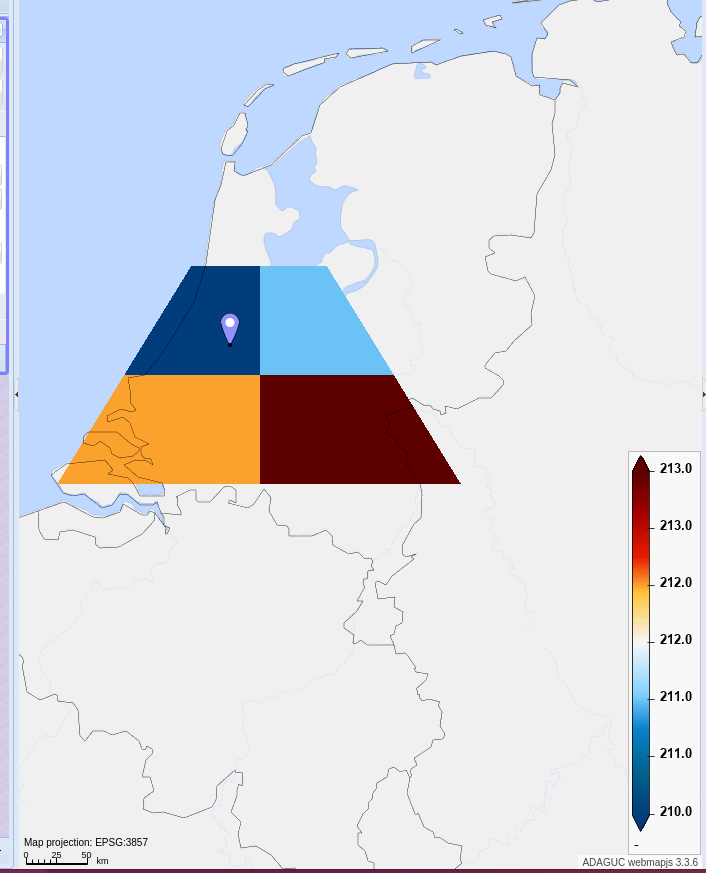

# Example format

[Back](./README.md)

This script will create a file where 

[Script to generate NetCDF file](../../python/format_standard/generate_example_file_latlonbnds.py)

## NetCDF file
``` 
netcdf example_file_latlonbnds {
dimensions:
        time = 3 ;
        threshold = 4 ;
        gridpoint = 4 ;
        bnds_loc = 4 ;
variables:
        int64 time(time) ;
                time:units = "hours since 2024-06-01 00:00:00" ;
                time:calendar = "proleptic_gregorian" ;
        int64 threshold(threshold) ;
        int64 gridpoint(gridpoint) ;
        string bnds_loc(bnds_loc) ;
        double probability(time, threshold, gridpoint) ;
                probability:coordinates = "lat lon" ;
        double lon_bnds(gridpoint, bnds_loc) ;
        double lat_bnds(gridpoint, bnds_loc) ;

// global attributes:
                :coordinates = "lat_bnds lon_bnds" ;
data:

 time = 0, 1, 2 ;

 threshold = 10, 20, 30, 40 ;

 gridpoint = 0, 1, 2, 3 ;

 bnds_loc = "down_left", "down_right", "up_left", "up_right" ;

 probability =
  0, 1, 2, 3,
  10, 11, 12, 13,
  20, 21, 22, 23,
  30, 31, 32, 33,
  100, 101, 102, 103,
  110, 111, 112, 113,
  120, 121, 122, 123,
  130, 131, 132, 133,
  200, 201, 202, 203,
  210, 211, 212, 213,
  220, 221, 222, 223,
  230, 231, 232, 233 ;

 lon_bnds =
  4, 5, 4.5, 5,
  5, 6, 5, 5.5,
  3.5, 5, 4, 5,
  5, 6.5, 5, 6 ;

 lat_bnds =
  52, 52, 52.5, 52.5,
  52, 52, 52.5, 52.5,
  51.5, 51.5, 52, 52,
  51.5, 51.5, 52, 52 ;
}
 
```

### Resulting image

