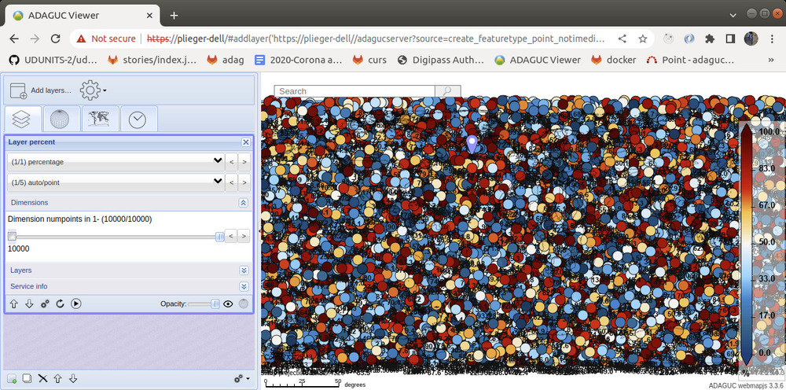

Pointtimeseries example
=======================

[Back](./README.md)

1. 10000 random points - no time dimension
1. Point timeseries NetCDF - Automated weather station observations
1. Random observations with a timestamp (earthquakes)
1. Random events fixed in timeslots (lightning)
1. TODO symbols

## 1) 10000 random points - no time dimension
------------------------------------------

This demonstrates how a file with 10000 points can be created and displayed in ADAGUC.

- [Python script create_featuretype_point_notimedim.py](../../python/format_standard/create_featuretype_point_notimedim.py) 
- [Netcdf file create_featuretype_point_notimedim.nc](../../data/datasets/create_featuretype_point_notimedim.nc)
  
  



Or see it in the [adaguc-viewer](https://adaguc.knmi.nl/adaguc-viewer/index.html#addlayer('https://geoservices.knmi.nl/adagucserver?dataset=create_featuretype_point_notimedim&','create_featuretype_point_notimedim'))

The NetCDF file should have the following structure:
```
netcdf create_featuretype_point_notimedim {
dimensions:
        numpoints = 10000 ;
variables:
        double lat(numpoints) ;
                lat:units = "degrees_north" ;
                lat:standard_name = "latitude" ;
        double lon(numpoints) ;
                lon:units = "degrees_east" ;
                lon:standard_name = "longitude" ;
        float percent(numpoints) ;
                percent:units = "%" ;
                percent:standard_name = "percentage" ;

// global attributes:
                :featureType = "point" ;
                :Conventions = "CF-1.4" ;
}
```

The ADAGUC configuration for the Layer object looks like this:

```xml
<?xml version="1.0" encoding="UTF-8" ?>
<Configuration>
	<Legend name="bluewhitered" type="colorRange">
		<palette index="0" red="0" green="60" blue="123"/>
		<palette index="30" red="0" green="100" blue="140"/>
		<palette index="60" red="8" green="130" blue="206"/>
		<palette index="85" red="132" green="211" blue="255"/>
		<palette index="120" red="247" green="247" blue="247"/>
		<palette index="155" red="255" green="195" blue="57"/>
		<palette index="180" red="232" green="28" blue="0"/>
		<palette index="210" red="165" green="0" blue="0"/>
		<palette index="240" red="90" green="0" blue="0"/>
	</Legend>
	<Style name="randompoint1">
		<Legend fixed="true" tickinterval="10">bluewithred</Legend>
		<Min>0</Min>
		<Max>100</Max>
		<NameMapping name="point" title="Points" abstract="Points"/>
		<Point plotstationid="false" pointstyle="point" discradius="8"
  textradius="0" dot="true" fontsize="14" textcolor="#FFFFFF"
  textformat=" "/>
	</Style>
	<Layer type="database">
		<Group value="tests"/>
		<Title>10000 random points!</Title>
		<FilePath>/data/adaguc-data/formatstandard/create_featuretype_point_notimedim.nc</FilePath>
		<Variable>percent</Variable>
		<Styles>randompoint1</Styles>
	</Layer>
</Configuration>
```

## 2) Point timeseries NetCDF - Automated weather station observations
-------------------------------------------------------------------

This file contains observations over time for several stations, this is
usually used to store observations from fixed automated weather stations
over time.

- [Python script createncpoint.py](../../python/examples/others/createncpoint.py) 
- [NetCDF file createncpoint.nc](../../data/datasets/createncpoint.nc) 


See it in the [adaguc-viewer using the OBS dataset](https://adaguc.knmi.nl/adaguc-viewer/index.html?srs=EPSG%3A3857&bbox=113752.93491204857,6596199.66440692,1008912.1492569514,7448076.45520108&service=https%3A%2F%2Fgeoservices.knmi.nl%2Fwms%3FDATASET%3DOBS%26&layer=10M%2Fta%24image%2Fpng%24true%24observation.temperature%2Fpoint%241%240&selected=0&dims=time$currentZ&baselayers=WorldMap$countryborders)


The data for each parameter is organised as a table with a station and a
time dimension.
```
netcdf KIS___OPER_P___OBS_____L2 {
  dimensions:
        station = 149 ;
        time = 23538 ;
  variables:
        string station(station) ;
                station:long_name = "station name" ;
                station:cf_role = "timeseries_id" ;
        double time(time) ;
                time:long_name = "time of measurement" ;
                time:standard_name = "time" ;
                time:units = "seconds since 1950-01-01 00:00:00" ;
        double lat(station) ;
                lat:long_name = "station  latitude" ;
                lat:standard_name = "latitude" ;
                lat:units = "degrees_north" ;
        double lon(station) ;
                lon:long_name = "station longitude" ;
                lon:standard_name = "longitude" ;
                lon:units = "degrees_east" ;
        short TG(station, time) ;
                TG:coordinates = "lat lon" ;
                TG:kisid = "TG" ;
                TG:description = "Daily mean temperature in (0.1 degrees Celsius);" ;
                TG:_FillValue = -9999s ;
                TG:standard_name = "air_temperature" ;
                TG:units = "degrees Celsius" ;
                TG:long_name = "Temperature" ;
                TG:scale_factor = 0.1f ;
                TG:add_offset = 0.f ;
        char projection ;
                projection:EPSG_code = "EPSG:4326" ;

// global attributes:
                :featureType = "timeSeries" ;
                :Conventions = "CF-1.4" ;
                :title = "KIS___OPER_P___OBS_____L2" ;
                :institution = "Royal Netherlands Meteorological Institute (KNMI)" ;
                :source = "Royal Netherlands Meteorological Institute (KNMI)" ;
                :history = "File created from KIS ASCII file. " ;
                :references = "http://data.knmi.nl" ;
                :comment = "none" ;
}

```

The ADAGUC configuration looks like this:
```xml
<Legend name="temperature" type="interval">
  <palette index="0" color="#2E2E73"/> <!-- -14 -->
  <palette index="9" color="#282898"/> <!-- -12 -->
  <palette index="18" color="#201FBB"/> <!-- -10 -->
  <palette index="27" color="#1A1ADC"/> <!-- -8 -->
  <palette index="36" color="#3654DE"/> <!-- -6 -->
  <palette index="45" color="#548EDC"/> <!-- -4 -->
  <palette index="54" color="#72CADE"/> <!-- -2 -->
  <palette index="63" color="#6DD8DF"/> <!-- 0-->
  <palette index="72" color="#55CDE2"/> <!-- 2-->
  <palette index="81" color="#38BBDC"/> <!-- 4 -->
  <palette index="90" color="#20B0DC"/> <!-- 6 -->
  <palette index="99" color="#19BAA6"/> <!-- 8 -->
  <palette index="108" color="#1CCE6A"/> <!-- 10 -->
  <palette index="117" color="#1BDF22"/> <!-- 12 -->
  <palette index="126" color="#82C319"/> <!-- 14 -->
  <palette index="135" color="#DCA819"/> <!-- 16 -->
  <palette index="144" color="#DD921A"/> <!-- 18 -->
  <palette index="153" color="#DE7C1A"/> <!-- 20 -->
  <palette index="162" color="#DF671A"/> <!-- 22 -->
  <palette index="171" color="#DE501A"/> <!-- 24 -->
  <palette index="180" color="#DD3819"/> <!-- 26 -->
  <palette index="189" color="#DD2319"/> <!-- 28 -->
  <palette index="198" color="#D21A1E"/> <!-- 30 -->
  <palette index="207" color="#C31927"/> <!-- 32 -->
  <palette index="216" color="#AD1A30"/> <!-- 34 -->
  <palette index="225" color="#9A1A3B"/> <!-- 36 -->
  <palette index="234" color="#871A44"/> <!-- 38 -->
  <palette index="240" color="#871A44"/> <!-- 39,33 -->
</Legend>

<Style name="temperature">
  <Legend fixed="true" tickinterval="2">temperature</Legend>
  <Min>-14</Min>
  <Max>39,33333333</Max> <!-- 39,33333333 = (240 / (234/(38 - -14)))- 14 -->
  <NameMapping name="point" title="Temperature"
  abstract="Temperature"/>
  <Point plotstationid="false" pointstyle="point" discradius="15" textradius="0" dot="false" fontsize="8" textcolor="#000000" />
</Style>

<Layer type="database">
  <Group value="KNMI Daily Obs"/>
  <FilePath filter="\^.*\.nc$">/data/services/data/testsets/pointtimeseries/KIS*OPER_POBS*_L2.nc</FilePath>
  <Variable>TG</Variable>
  <Styles>temperature</Styles>
</Layer>
```

## 3) Random observations with a timestamp (earthquakes)
-----------------------------------------------------

This file is characterized by random observations which occur over time.
This file has no time dimension, but has time attached to each
observation.


```
netcdf EQ____OPER_P___OBS_____L2 {
dimensions:
        obs = 100 ;
variables:
        string location(obs) ;
                location:long_name = "Location name" ;
                location:units = "string" ;
                location:coordinates = "time lat lon depth" ;
        string phase_file(obs) ;
                phase_file:long_name = "Phase file name" ;
                phase_file:units = "string" ;
                phase_file:coordinates = "time lat lon depth" ;
        string type(obs) ;
                type:long_name = "Event type" ;
                type:units = "string" ;
                type:coordinates = "time lat lon depth" ;
        double time(obs) ;
                time:long_name = "Time of measurement" ;
                time:standard_name = "time" ;
                time:units = "days since 1970-01-01 00:00:00" ;
        double lat(obs) ;
                lat:long_name = "Latitude of the observation" ;
                lat:standard_name = "latitude" ;
                lat:units = "degrees_north" ;
        double lon(obs) ;
                lon:long_name = "Longitude of the observation" ;
                lon:standard_name = "longitude" ;
                lon:units = "degrees_east" ;
        double depth(obs) ;
                depth:long_name = "Vertical distance below the surface" ;
                depth:standard_name = "height" ;
                depth:units = "km" ;
                depth:axis = "Z" ;
                depth:positive = "down" ;
        double magnitude(obs) ;
                magnitude:long_name = "Richter magnitude scale" ;
                magnitude:standard_name = "magnitude" ;
                magnitude:units = "magnitude" ;
                magnitude:coordinates = "time lat lon depth" ;
        char projection ;
                projection:EPSG_code = "EPSG:4326" ;

// global attributes:
                :featureType = "point" ;
                :Conventions = "CF-1.4" ;
                :title = "EQ____OPER_P___OBS_____L2" ;
                :institution = "Royal Netherlands Meteorological Institute (KNMI)" ;
                :source = "Royal Netherlands Meteorological Institute (KNMI)" ;
                :history = "File created from last100.json JSON file. " ;
                :references = "http://data.knmi.nl" ;
                :comment = "none" ;
}
```

The configuration in ADAGUC looks like this:
```xml
<Legend name="magnitude" type="colorRange">
  <palette index="0" color="#55005550"/>  <!-- 0 Nothing -->
  <palette index="20" color="#66009980"/>  <!-- 1 Insignificant -->
  <palette index="40" color="#0099FF80"/> <!-- 2 Low -->
  <palette index="60" color="#00CC99B0"/> <!-- 3 Minor -->
  <palette index="80" color="#99CC66B0"/> <!-- 4 Moderate -->
  <palette index="100" color="#99FF33B0"/> <!-- 5 Intermediate -->
  <palette index="120" color="#FFFF33B0"/> <!-- 6 Noteworthy -->
  <palette index="140" color="#FFCC66C0"/> <!-- 7 High -->
  <palette index="160" color="#FF9966D0"/> <!-- 8 Far-reaching -->
  <palette index="180" color="#FF3300E0"/> <!-- 9 Outstanding -->
  <palette index="200" color="#CC0000FF"/> <!-- 10 Extraordinary -->
  <palette index="220" color="#880000FF"/> <!-- 11 ! -->
  <palette index="239" color="#000000FF"/> <!-- 12 !! -->
</Legend>
<Style name="magnitude">
  <Legend fixed="true" tickinterval="1">magnitude</Legend>
  <Min>0</Min>
  <Max>12</Max>
  <NameMapping name="point"        title="Richter magnitude scale" abstract="Wth continuous colors"/>
  <Point plotstationid="false" pointstyle="point" discradius="20" textradius="0" dot="false" fontsize="14" textcolor="#FFFFFF"/>
</Style>

<Layer type="database">
  <Group value="KNMI Earthquakes NL"/>
  <FilePath filter="^.*\.nc$">/data/services/data/testsets/pointtimeseries/EQ____OPER_P___OBS_____L2.nc</FilePath>
  <Variable>magnitude</Variable>
  <Styles>magnitude</Styles>
</Layer>

```

## 4) Random events fixed in timeslots (lightning)
-----------------------------------------------

This is an example on how a timeseries of lightning events can be
quantized in fixed timeslots. This enables for example the animated
display of multiple lightning detections over 5 minute time intervals.
This is achieved by creating netcdf files each containing a timeslot
with lightning events. The NetCDF files must have a time dimension of
length 1 and contains all events in that timeslot.


```
netcdf btd_20150605T180000 {
dimensions:
        obs = 5 ;
        time = 1 ;
variables:
        double lat(obs) ;
                lat:units = "degrees_north" ;
                lat:standard_name = "latitude" ;
        double lon(obs) ;
                lon:units = "degrees_east" ;
                lon:standard_name = "longitude" ;
        double time(time) ;
                time:units = "seconds since 1970-01-01 00:00:00" ;
                time:standard_name = "time" ;
        double warningindicator(obs, time) ;
                warningindicator:units = "warningindicator" ;
                warningindicator:standard_name = "warningindicator" ;
        double warningflag(obs, time) ;
                warningflag:units = "warningflag" ;
                warningflag:standard_name = "warningflag" ;

// global attributes:
                :featureType = "point" ;
                :Conventions = "CF-1.4" ;
}
```

The ADAGUC configuration contains a layer with a Dimension definition,
this dimension has an interval of 5 minutes:

```xml
<Style name="btd">
  <Legend fixed="true">bluewhitered</Legend>
  <Min>0</Min>
  <Max>2</Max>
  <Point discradius="5" textformat=" " dot="false"/>
</Style>

<Layer type="database">
  <Group value="BTD300 test"/>
  <Title>BTD300 warning flag</Title>
  <Variable>warningflag</Variable>
  <FilePath filter="^btd_.*\.nc$">/data/services/data/testsets/btdsensor/</FilePath>
  <Dimension name="time" interval="PT5M" default="min">time</Dimension>
  <Styles>btd</Styles>
</Layer>
```
