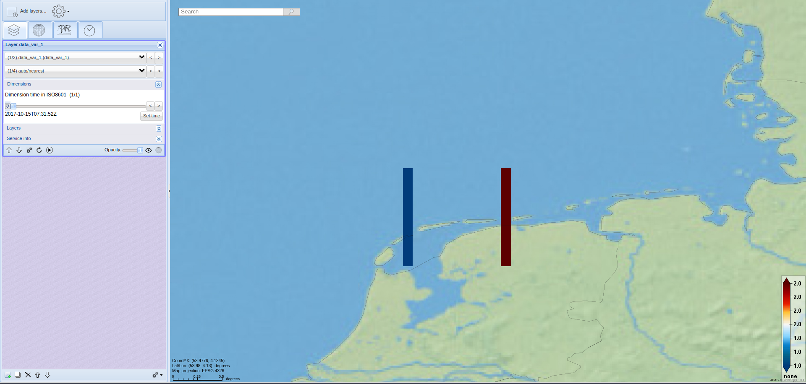

# Example format

[Back](./README.md)

[Script to generate NetCDF file](../../python/format_standard/generate_example_file_vector_format.py)

## NetCDF file
``` 
dimensions:
    time = 2 ; 
    nv = 4 ;
variables:
    double time(time) ;
        time:standard_name = "time" ;
        time:long_name = "time" ;
        time:units = "seconds since 1970-01-01 00:00:00" ;
    float lon(time) ;
        lon:standard_name = "longitude" ;
        lon:long_name = "longitude" ;
        lon:units = "degrees_east" ;
        lon:bounds = "lon_bnds" ;
    float lat(time) ;
        lat:standard_name = "latitude" ;
        lat:long_name = "latitude" ;
        lat:units = "degrees_north" ;
        lat:bounds = "lat_bnds" ;
    float lon_bnds(time, nv) ;
    float lat_bnds(time, nv) ;
    double data_var_1(time) ;
        data_var_1:standard_name = "Standard name of data variable 1" ;
        data_var_1:long_name = "Long name of data variable 1" ;
        data_var_1:units = "Units of data variable 1" ;
data:
 time = 1508052712, 1508052713 ;
 
 lon = 5.05, 6,05 ;
 
 lat = 53.5, 53.5 ;
 
 lon_bnds =
  5.1, 5.1, 5, 5,
  6.1, 6.1, 6, 6 ;
  
 lat_bnds =
  53, 54, 54, 53,
  53, 54, 54, 53 ;
  
 data_var_1 = 1, 2 ;
 
```

### Resulting image

