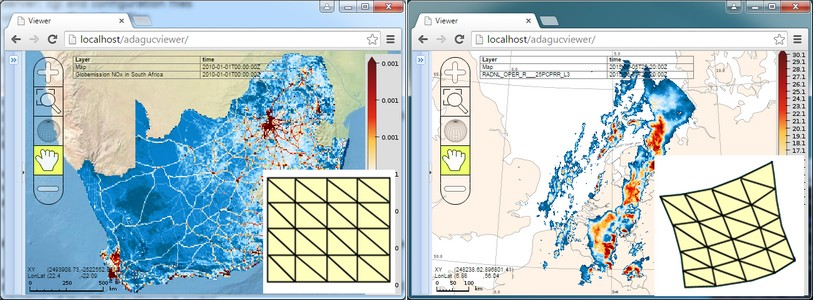
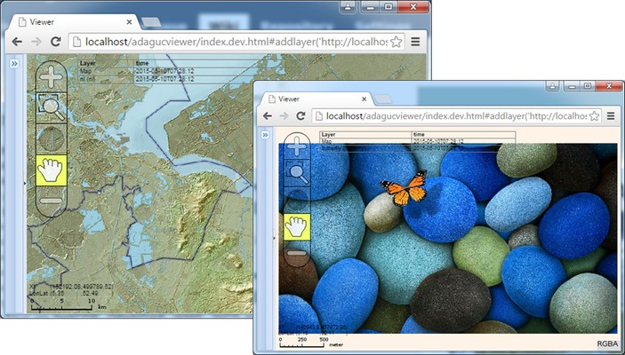

DataFormats
===========

The Adaguc server can visualise a number of dataypes from data in NetCDF
datafiles (NetCDF3 and NetCDF4). Data can also be read from some types
of HDF5 files, like HDF5 files according to the KNMI HDF5 specification.
When NetCDF data is following the CF conventions, simple automated
visualisation is possible by using this extra information. The CF
Conventions are described in detail on the
[CF-Metadata](http://cf-pcmdi.llnl.gov) site.

Data types
----------

### Structured Grid or field information - Model/satellite/radar etc. (NetCDF)

NetCDF files using structured grids contain variables with gridded data,
this type of NetCDF file occur most frequently. There are two types of
structured grids, unprojected grids in standard lat/lon projection and
projected grids described according a geographical projection. When
projected data is used, parameter variables need to link to projection
variables to describe the geographical projection and projection
coordinates need to be described. Usually the geographical projection is
also described by giving all longitudes and latitudes for all grid
points. These files are the "classic" examples of CF Convention
following files. ADAGUC only uses the projection variable and the
projection coordinates to calculated the coordinates for each grid
point, it does not read all latitudes and longitudes for every grid
point and are not required to plot the data correctly.



Example of a regular lat/lon NetCDF file (topleft image):
```
netcdf latlon {
dimensions:
lon = 360 ;
lat = 180 ;
time = 12 ;
variables:
double lon(lon) ;
lon:long_name = "longitude" ;
lon:standard_name = "longitude" ;
lon:units = "degrees_east" ;
double lat(lat) ;
lat:long_name = "latitude" ;
lat:standard_name = "latitude" ;
lat:units = "degrees_north" ;
double time(time) ;
time:long_name = "time" ;
time:units = "days since 2010-01-01 00:00:00" ;
double NOx(time, lat, lon) ;
NOx:Units = "Gg N/km2" ;

// global attributes:
:Conventions = "CF-1.4" ;
}
```

Example of a projected coordinate system, uses a polar stereographic
projection (topright image):
```
netcdf projected {
dimensions:
x = 700 ;
y = 765 ;
time = 1 ;
variables:
double x(x) ;
x:long_name = "x coordinate of projection" ;
x:standard_name = "projection_x_coordinate" ;
x:units = "km" ;
double y(y) ;
y:long_name = "y coordinate of projection" ;
y:standard_name = "projection_y_coordinate" ;
y:units = "km" ;
double time(time) ;
time:units = "minutes since 1950-01-01 0:0:0" ;
time:long_name = "time" ;
time:standard_name = "time" ;
float precipitation(time, y, x) ;
precipitation:grid_mapping = "projection" ;
precipitation:_FillValue = -1.f ;
precipitation:long_name = "precipitation flux" ;
precipitation:units = "kg/m2/h" ;
precipitation:standard_name = "precipitation_flux" ;
char projection ;
projection:EPSG_code = "none" ;
projection:grid_mapping_name = "polar_stereographic" ;
projection:latitude_of_projection_origin = 90. ;
projection:straight_vertical_longitude_from_pole = 0. ;
projection:scale_factor_at_projection_origin = 0.933012709177451 ;
projection:false_easting = 0. ;
projection:false_northing = 0. ;
projection:semi_major_axis = 6378140. ;
projection:semi_minor_axis = 6356750. ;
projection:proj4_params = "+proj=stere +lat_0=90 +lon_0=0 +lat_ts=60
+a=6378.14 +b=6356.75 +x_0=0 y_0=0" ;
projection:long_name = "projection" ;

// global attributes:
:Conventions = "CF-1.4" ;
}
```

### RGBA grid information / True color images (NetCDF)

A special case are geographical grids which do not contain values of a
parameter, but contains the RGBA value of the colour that should be
presented at that grid point. This kind of information is usually found
in satellite products, where the values of different bands are combined
(composited) into one RGB or RGBA value. The value of the parameter at a
grid point is the value that should be plotted on the visualisation. You
could see these fields as color photos, where each pixel is
georeferenced.



The CF-conventions currently have no way to describe these parameters,
so these files are generated as fields of 32 bit unsigned integers, each
containing an RGBA value. The configuration of the layer tells the
service that the parameter values should be interpreted as pixel color
values, this can be done by choosing [RenderMethod](RenderMethod.md) rgba. The
service can then reproject the image from the source projection, if
needed, by doing a nearest neighbor "interpolation". When the
standard_name "rgba" and units "rgba" is given for the corresponding
variable, the system detects that this is a RGBA/True color variable.
The variable type should be unsigned integer (NC_UINT) and represents 4
bytes for R,G,B and A respectively.

```
netcdf butterfly_fromjpg_truecolor {
dimensions:
y = 1080 ;
x = 1920 ;
time = 1 ;
variables:
double y(y) ;
y:units = "m" ;
y:standard_name = "projection_y_coordinate" ;
double x(x) ;
x:units = "m" ;
x:standard_name = "projection_x_coordinate" ;
double time(time) ;
time:units = "seconds since 1970-01-01 00:00:00" ;
time:standard_name = "time" ;
byte projection ;
projection:proj4 = "+proj=sterea +lat_0=52.15616055555555
+lon_0=5.38763888888889 +k=0.9999079 +x_0=155000 +y_0=463000
+ellps=bessel +units=m +no_defs" ;
uint butterfly(time, y, x) ;
butterfly:units = "rgba" ;
butterfly:standard_name = "rgba" ;
butterfly:long_name = "butterfly" ;
butterfly:grid_mapping = "projection" ;

// global attributes:
:Conventions = "CF-1.4" ;
}
```

### Point data (NetCDF)

Point data is new in CF Conventions is characterised by a global
attribute **featureType = "timeSeries"** in the NetCDF file.


A detailed example is described here: \[\[Pointtimeseries_example\]\]

### Forecast reference times from model runs

Adaguc can display model data with forecasts. Multiple files with
different forecast_reference_time's and overlapping times can be
aggregated in a single layer.

A variable with standard_name forecast_reference_time should be
present in the netcdf file(s):
```
double forecast_reference_time ;
forecast_reference_time:units = "seconds since 1970-01-01 00:00:00
+00:00" ;
forecast_reference_time:standard_name = "forecast_reference_time"
```

This variable can be either a scalar or a variable with multiple dates.

### Ugrid data

Experimental support for UGRID data (meshes and polygons) is built in.
When a NetCDF file with UGRID convention is configured in the service,
the service will render a GetMap image with the UGRID mesh displayed in
it.


For details on the UGRID format you can visit
https://github.com/ugrid-conventions/ugrid-conventions.

### Curvilinear data


### Vector data - Swath information (NetCDF)

The ADAGUC service can handle swath data from orbiting satellites in the
so called ADAGUC-format, described at
http://adaguc.knmi.nl/contents/documents/ADAGUC_Standard.html (called
vector data there). This data is organized in time related rows of
geographical "tiles" or "pixels" each representing one measured value.

### Swath data - ASCAT data (NetCDF)

The ASCAT NetCDF data format (see http:www.knmi.nl/scatterometer)
describes measured wind direction and wind speed (and some other
parameters) for polar orbiting satellites. This file format is
recognised by the ADAGUC server.
Data is organised in a grid of values for a certain parameter. Wind
direction and wind speed (which are the main scatterometer products)can
be depicted by the service as wind barbs or wind vectors.
The ADAGUC standard distinguishes between **geographic raster data** and
**projected raster data**. The grid of geographic raster data can be
described by two axes (two series of points). The grid of projected
raster data also has two axes, but these do not contain geographic
coordinates. The NetCDF files contain parameters (two-dimensional) for
the latitude and longitude of each grid-point. This kind of raster is
for example found in numerical model data with a rotated lat-lon grid
like HIRLAM.

### Vector components in gridded fields, e.g. U and V for wind (NetCDF)

In certain data sets, in particular in the case of numerical weather
model output, wind is available as two vector components. For displaying
wind vectors or wind barbs these two components have to be combined into
a wind direction parameter and a wind speed parameter. These u and v
vectors can be oriented along the model grid or can be oriented along
true north/east directions. The former case is often found in models
which have a rotated grid; these rotations are sometimes used to get rid
of erratic behaviour of models around the poles. For example HIRLAM data
is expressed in a rotated lat lon grid, with grid-oriented u and v
vectors.
When calculating (wind) speed and direction from grid-oriented u and v
vectors for display of barbs or vectors, the service takes into account
the rotated grid if needed by inspection of the standard_name attribute
of the u-component.

### HDF5 data

The ADAGUC service can read HDF5 files in the KNMI HDF5 format. These
files for satellite and radar measurements contain metadata for the
projection and the time of the measurement. The ADAGUC service can not
handle HDF5 lightning files currently, nor can it handle radar elevation
data.
**Update since 2015-07-13**
The server is able to read KNMI HDF5 precipitation forecast data. These
files contain several image groups with a forecast date timestamp. These
image groups are aggregated to a single variable with time dimension,
this new variable is called "forecast". KNMI files lik RAD_NL25_PCP_FM_201506180815.h5 are supported.
