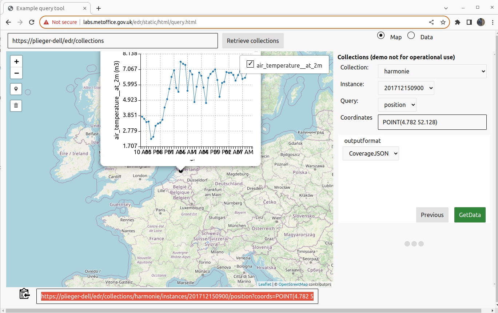

# Configure an EDR timeseries service using AdagucServer

- [Back to readme](./Readme.md)
- [Configuration details for EDR](../configuration/EDRConfiguration/EDR.md)

## Prerequisites

Make sure adaguc-server is running, follow the instructions at [Starting the adaguc-server with docker](../Running.md)

## Step 1: Copy a file with timesteps into the adaguc-data folder

Copy the file from the adaguc-server repository under `data/datasets/forecast_reference_time/HARM_N25_20171215090000_dimx16_dimy16_dimtime49_dimforecastreferencetime1_varairtemperatureat2m.nc` into the configured adaguc-data folder:

```bash
cp ${ADAGUC_PATH}/data/datasets/forecast_reference_time/HARM_N25_20171215090000_dimx16_dimy16_dimtime49_dimforecastreferencetime1_varairtemperatureat2m.nc ${ADAGUC_DATA_DIR}
```

## Step 2: Configure a dataset for this datafile, including EDR support

Create the following file at the filepath `$ADAGUC_DATASET_DIR/edr.xml`. You can also consider changing `<FilePath>` to `/data/adaguc-data/*.nc`.

```xml
<?xml version="1.0" encoding="UTF-8" ?>
<Configuration>
    <!-- Styles -->
    <Style name="temperature">
        <Legend fixedclasses="true" textformatting="%0.0f" tickinterval="2">bluewhitered</Legend>
        <Min>-10</Min>
        <Max>10</Max>
    </Style>

    <!-- Layers -->
    <Layer type="database">
        <Group collection="mycollection" />
        <FilePath>/data/adaguc-data/HARM_N25_20171215090000_dimx16_dimy16_dimtime49_dimforecastreferencetime1_varairtemperatureat2m.nc</FilePath>
        <Variable units="Celsius">air_temperature__at_2m</Variable>
        <Styles>temperature</Styles>
        <Name>my_cool_name</Name>
        <Title>My cool title</Title>
    </Layer>
</Configuration>
```

For the given example this will result in the following parameter name definition:

```json
"parameter_names": {
  "air_temperature__at_2m": {
    "type": "Parameter",
    "id": "air_temperature__at_2m",
    "label": "air_temperature__at_2m",
    "unit": {
      "symbol": {
        "value": "Celsius",
        "type": "http://www.opengis.net/def/uom/UCUM"
      }
    },
    "observedProperty": {
      "id": "https://vocab.nerc.ac.uk/standard_name/air_temperature",
      "label": "air_temperature__at_2m"
    }
  }
}
```

## Step 3: Scan the new data

```bash
docker exec -i -t my-adaguc-server /adaguc/scan.sh -d edr
```

## Step 4: Check if the EDR endpoint works

The EDR endpoint is at `/edr/collections`. This will list all the configured collections.

You can find the collection from above under `edr.mycollection`. This EDR collection name is a combination of the dataset name (`edr`) and the "group collection" (`mycollection`).

The following examples test the `/collections`, `/instances`, `/position` and the `/cube` EDR calls:
- https://yourhostname/edr/collections
- https://yourhostname/edr/collections/edr.mycollection
- https://yourhostname/edr/collections/edr.mycollection/instances
- https://yourhostname/edr/collections/edr.mycollection/instances/201712150900
- https://yourhostname/edr/collections/edr.mycollection/instances/201712150900/position?coords=POINT(4.782%2052.128)&datetime=2017-12-15T09:00Z/2017-12-17T09:00Z&parameter-name=air_temperature__at_2m&crs=EPSG:4326&f=CoverageJSON
- https://yourhostname/edr/collections/edr.mycollection/instances/201712150900/cube?bbox=5,52,7,54&datetime=2017-12-15T09:00Z/2017-12-17T09:00Z&parameter-name=air_temperature__at_2m&crs=EPSG:4326&f=CoverageJSON


You can also try pasting your EDR endpoint https://yourhostname/edr/collections in https://labs.metoffice.gov.uk/edr/static/html/query.html.


See:


