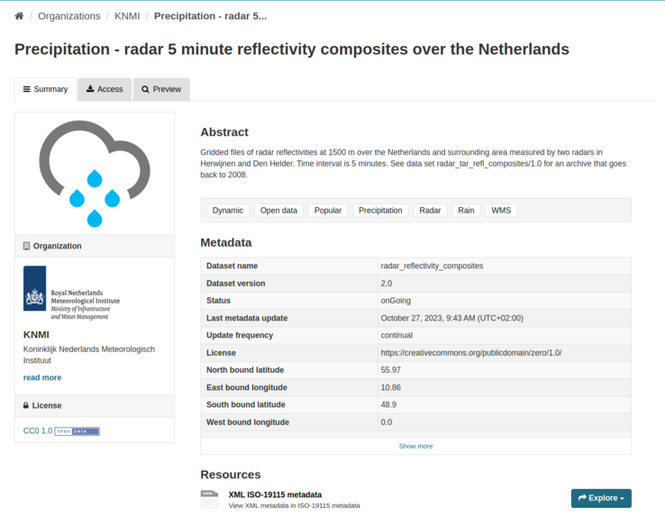
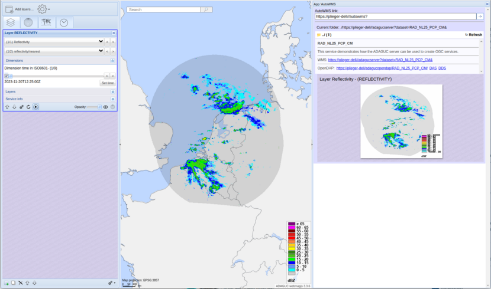

Create a WMS service on a series of KNMI HDF5 files obtained from the KNMI data platform
===============================================================

[Back to readme](./Readme.md)


# Prerequisites

Make sure adaguc-server is running, follow the instructions at [Starting the adaguc-server with docker](../Running.md)

Please note: Here we assume that the data folder is in `${HOME}/adaguc-docker/adaguc-data` and that the dataset configuration folder is in `${HOME}/adaguc-docker/adaguc-datasets`. If it is setup otherwise, please apply the instructions accordingly.

To check where your folders are, best is to look into the .env file in the Docker folder:

```
cat .env

# outputs:

ADAGUC_DATA_DIR=/home/plieger/adaguc-docker/adaguc-data
ADAGUC_AUTOWMS_DIR=/home/plieger/adaguc-docker/adaguc-autowms
ADAGUC_DATASET_DIR=/home/plieger/adaguc-docker/adaguc-datasets
ADAGUC_PORT=443
EXTERNALADDRESS=https://plieger-dell/
```

Also note: The directories on your workstation are always mapped to the same directories in the docker container. This ensures that configuration files are interchangeable between systems.

A tip to list the actual contents in the docker container is to do:

```
docker exec -i -t my-adaguc-server bash -c "ls -lrt /data/adaguc-data"
docker exec -i -t my-adaguc-server bash -c "ls -lrt /data/adaguc-datasets"
``````


# Step 1: Download data from the KNMI dataplatform

Visit https://dataplatform.knmi.nl/dataset/radar-reflectivity-composites-2-0, and download a series of `.h5` files




# Step 2: Copy the HDF5 files into the adaguc-data folder

copy the `.h5` files into the adaguc-data folder:

```
cp ~/Downloads/RAD_NL25_PCP_NA_*.h5 ${HOME}/adaguc-docker/adaguc-data
```

Check if the docker container really sees the h5 files:

```
docker exec -i -t my-adaguc-server bash -c "ls -lrt /data/adaguc-data"
```

## Output:
```
-rw-rw-r-- 1 adaguc adaguc 113865 Nov 20 13:50 RAD_NL25_PCP_NA_202311201255.h5
-rw-rw-r-- 1 adaguc adaguc 113411 Nov 20 13:50 RAD_NL25_PCP_NA_202311201250.h5
-rw-rw-r-- 1 adaguc adaguc 113529 Nov 20 13:50 RAD_NL25_PCP_NA_202311201245.h5
-rw-rw-r-- 1 adaguc adaguc 113660 Nov 20 13:50 RAD_NL25_PCP_NA_202311201240.h5
-rw-rw-r-- 1 adaguc adaguc 113114 Nov 20 13:50 RAD_NL25_PCP_NA_202311201235.h5
-rw-rw-r-- 1 adaguc adaguc 113509 Nov 20 13:50 RAD_NL25_PCP_NA_202311201230.h5
-rw-rw-r-- 1 adaguc adaguc 113398 Nov 20 13:50 RAD_NL25_PCP_NA_202311201225.h5
-rw-rw-r-- 1 adaguc adaguc 111516 Nov 20 13:50 RAD_NL25_PCP_NA_202311201305.h5
-rw-rw-r-- 1 adaguc adaguc 112315 Nov 20 13:50 RAD_NL25_PCP_NA_202311201300.h5
```


# Step 3: Add the dataset configuration file


copy the `../doc/tutorials/data/RADAR/RAD_NL25_PCP_CM.xml` file into the adaguc-datasets folder:

```
cp ../doc/tutorials/data/RADAR/RAD_NL25_PCP_CM.xml ${HOME}/adaguc-docker/adaguc-datasets

```

Contents of the `RAD_NL25_PCP_CM.xml` file:

```xml
<?xml version="1.0" encoding="UTF-8" ?>
<Configuration>

  <WMS>
    <Title>RAD_NL25_PCP_CM_WMS</Title>
    <Abstract>Radar precipitation measurements above the Netherlands, on a 1.0x1.0 km grid, measurements are available in a five minute time interval. The intensity is in kg/m2/hour (mm/hour). The dataset is created from KNMI RAD_NL25_PCP_NA files. For interoperability, the original unit reflectivity in DBZ is converted to precipitation flux in kg/m2/h. The conversion from dbZ to kg/m2/h is applied with the formula R = 10^((PixelValue -109)/32).</Abstract>
  </WMS>

  <!-- Styles -->
  <Style name="reflectivity">
    <ShadeInterval min="-10000" max="00" fillcolor="#00000020" label="-"/>
    <ShadeInterval min="0" max="5" fillcolor="#00FFFF" />
    <ShadeInterval min="5" max="10" fillcolor="#6698ff" />
    <ShadeInterval min="10" max="15" fillcolor="#0000ff" />
    <ShadeInterval min="15" max="20" fillcolor="#00ff00" />
    <ShadeInterval min="20" max="25" fillcolor="#4cc417" />
    <ShadeInterval min="25" max="30" fillcolor="#348017" />
    <ShadeInterval min="30" max="35" fillcolor="#ffff00" />
    <ShadeInterval min="35" max="40" fillcolor="#fdd017" />
    <ShadeInterval min="40" max="45" fillcolor="#ff8040" />
    <ShadeInterval min="45" max="50" fillcolor="#ff0000" />
    <ShadeInterval min="50" max="55" fillcolor="#e41b17" />
    <ShadeInterval min="55" max="60" fillcolor="#800000" />
    <ShadeInterval min="60" max="65" fillcolor="#ff00ff" />
    <ShadeInterval min="65" max="10000" fillcolor="#800080" label="> 65" />
    <RenderMethod>nearest,bilinear</RenderMethod>
    <RenderSettings renderhint="discreteclasses" settings="fast" />
    <SmoothingFilter>8</SmoothingFilter>
  </Style>

  <!-- Layers -->
  <Layer type="database" hidden="false">
    <Name>REFLECTIVITY</Name>
    <Title>Reflectivity</Title>
    <Variable units="dBZ">image1.image_data</Variable>
    <FilePath filter="^RAD_NL25_PCP_NA.*\.h5$">/data/adaguc-data/</FilePath>
    <Dimension name="time" units="ISO8601" interval="PT5M" default="max">time</Dimension>
    <Styles>reflectivity</Styles>
  </Layer>

</Configuration>
```

This file is called a dataset configuration and is normally stored in the adaguc-datasets folder.

# Step 4: Scan the files

```
docker exec -i -t my-adaguc-server /adaguc/scan.sh -d RAD_NL25_PCP_CM
```

## Output:
```
Using adagucserver from  /adaguc/adaguc-server-master
Using config from /adaguc/adaguc-server-config.xml

*** Starting update for /data/adaguc-datasets/RAD_NL25_PCP_CM
[D:000:pid118: adagucserverEC/CRequest.cpp:110 CRequest]                        Dataset name based on passed configfile is [RAD_NL25_PCP_CM]
[D:001:pid118: adagucserverEC/CAutoResource.cpp:83 CAutoResource]               Found dataset /data/adaguc-datasets/RAD_NL25_PCP_CM.xml
[D:002:pid118: adagucserverEC/CDBFileScanner.cpp:954 CDBFileScanner]              ==> *** Starting update layer [REFLECTIVITY] ***
[D:003:pid118: adagucserverEC/CDBFileScanner.cpp:957 CDBFileScanner]            Using path [/data/adaguc-data], filter [^RAD_NL25_PCP_NA.*\.h5$] and tailpath []
[D:004:pid118: adagucserverEC/CDBFileScanner.cpp:1122 CDBFileScanner]           Reading directory /data/adaguc-data with filter ^RAD_NL25_PCP_NA.*\.h5$
[D:005:pid118: adagucserverEC/CDBFileScanner.cpp:994 CDBFileScanner]            Going to scan 9 files
[D:006:pid118: adagucserverEC/CDBFileScanner.cpp:133 CDBFileScanner]            Checking dim [time]
[D:007:pid118: adagucserverEC/CDBAdapterPostgreSQL.cpp:947 CDBAdapterPostgreSQL] New table created: Set indexes
[D:008:pid118: adagucserverEC/CDBFileScanner.cpp:378 CDBFileScanner]            Found dimension 0 with name time of type 2, istimedim: [1]
[D:009:pid118: adagucserverEC/CDBFileScanner.cpp:405 CDBFileScanner]            Marking table done for dim 'time' with table 't20231120t145051310_oljcpo0lqj9erof5p6he'.
[D:010:pid118: adagucserverEC/CDBFileScanner.cpp:528 CDBFileScanner]            Adding: 0/9 (time)       /data/adaguc-data/RAD_NL25_PCP_NA_202311201305.h5
[D:011:pid118: adagucserverEC/CDBFileScanner.cpp:528 CDBFileScanner]            Adding: 1/9 (time)       /data/adaguc-data/RAD_NL25_PCP_NA_202311201225.h5
[D:012:pid118: adagucserverEC/CDBFileScanner.cpp:528 CDBFileScanner]            Adding: 2/9 (time)       /data/adaguc-data/RAD_NL25_PCP_NA_202311201230.h5
[D:013:pid118: adagucserverEC/CDBFileScanner.cpp:528 CDBFileScanner]            Adding: 3/9 (time)       /data/adaguc-data/RAD_NL25_PCP_NA_202311201250.h5
[D:014:pid118: adagucserverEC/CDBFileScanner.cpp:528 CDBFileScanner]            Adding: 4/9 (time)       /data/adaguc-data/RAD_NL25_PCP_NA_202311201240.h5
[D:015:pid118: adagucserverEC/CDBFileScanner.cpp:528 CDBFileScanner]            Adding: 5/9 (time)       /data/adaguc-data/RAD_NL25_PCP_NA_202311201235.h5
[D:016:pid118: adagucserverEC/CDBFileScanner.cpp:528 CDBFileScanner]            Adding: 6/9 (time)       /data/adaguc-data/RAD_NL25_PCP_NA_202311201300.h5
[D:017:pid118: adagucserverEC/CDBFileScanner.cpp:528 CDBFileScanner]            Adding: 7/9 (time)       /data/adaguc-data/RAD_NL25_PCP_NA_202311201245.h5
[D:018:pid118: adagucserverEC/CDBFileScanner.cpp:528 CDBFileScanner]            Adding: 8/9 (time)       /data/adaguc-data/RAD_NL25_PCP_NA_202311201255.h5
[D:019:pid118: adagucserverEC/CDBFileScanner.cpp:1072 CDBFileScanner]             ==> *** Finished update layer [REFLECTIVITY] ***
[D:020:pid118: adagucserverEC/CRequest.cpp:3500 CRequest]                       ***** Finished DB Update *****
```

# Step 5: Look at your new WMS service

Your dataset is now ready to be viewed:

For example with firefox:
```
. .env && firefox ${EXTERNALADDRESS}
```

The dataset is named `RAD_NL25_PCP_CM` and is referenced in the url via `dataset=RAD_NL25_PCP_CM`


```
https://yourcomputer/wms?dataset=RAD_NL25_PCP_CM
```

It should look like: 




