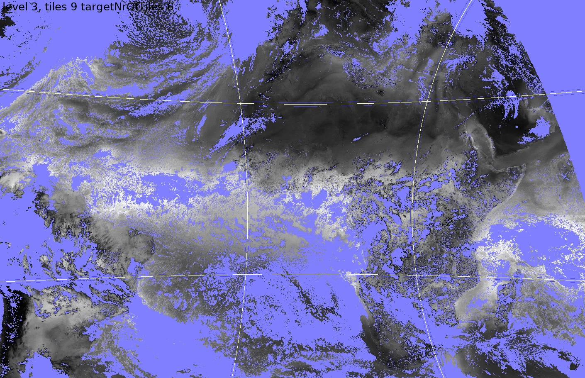

Faster WMS by enabling tiling for large datasets like MeteoSat Third Generation (for NWCSAF)
===============================================

Large NetCDF files can be translated into multiple smaller ones at different resolutions. This uses a tile pyramid. This makes it possible for the WMS server to quickly generate images for the GetMap requests. For the WMS client there is no difference if tiling is used or not. 

[Back to readme](./Readme.md).

Add to your layer:

```xml
<TileSettings debug="true" autotile="true" maxtilesinimage="32"/> <!-- Note that you can set autotile also to "file" to start tiling only when the file is explicitly specified. -->
```

See TileSettings for details. [TileSettings](../configuration/TileSettings.md) - Configuration settings for tiling high    resolution layers.

Example for NWCSAF S_NWC_WV09_MTI1_GLOBAL-NR:

`nwcsaf_mtg.xml`:
```xml
<?xml version="1.0" encoding="UTF-8" ?>
<Configuration>
  <WMS>
    <WMSFormat name="image/png" format="image/webp"/>
  </WMS>

  <Style name="kg-m2">
    <Legend tickinterval="10">gray</Legend>
    <Min>0</Min>
    <Max>60</Max>
    <RenderMethod>nearest</RenderMethod>
  </Style>

  <Layer type="database">
    <Name>tcwvtiled</Name>
    <Title>TCWV tiled</Title>
    <Variable>tcwv</Variable>
    <FilePath filter="^S_NWC_WV09_MTI1_GLOBAL-NR.*\.nc$">/data/adaguc-data/NWCSAF/</FilePath>
    <Dimension name="time" interval="PT10M">time</Dimension>
    <TileSettings debug="true" autotile="true" maxtilesinimage="32"/>
    <Styles>kg-m2</Styles>
  </Layer>

</Configuration>
```


After this you can scan new data as normal. Tiles will be generated automatically and the WMS service will be significantly faster.

*NOTE: If you want to add another layer with the same filepath and filter - but without tilesettings -, you need to specify another databasetable otherwise the layers will interfere. This is needed if you for example want to compare the performance between the layers. You can do this by adding:
```xml
<DataBaseTable>tcwv-non-tiled</DataBaseTable>
```


Using docker:
```sh
docker exec -i -t my-adaguc-server /adaguc/scan.sh -d nwcsaf_mtg
```
or locally:
```sh
 ./scripts/scan.sh -d nwcsaf_mtg
```

```
Scanning full dataset [nwcsaf_mtg]:
/home/plieger/code/github/KNMI/adaguc-server/bin/adagucserver --updatedb --verboseoff --config /home/plieger/code/github/KNMI/adaguc-server/python/lib/adaguc/adaguc-server-config-python-postgres.xml,nwcsaf_mtg
[D:000:pid640062: adagucserverEC/CDBFileScanner.cpp:885]                          ==> *** Starting update layer [tcwvtiled] ***
[D:001:pid640062: adagucserverEC/CDBFileScanner.cpp:1078]                       Reading directory /data/adaguc-data/NWCSAF with filter ^S_NWC_WV09_MTI1_GLOBAL-NR.*\.nc$
[D:002:pid640062: adagucserverEC/CDBFileScanner.cpp:804]                        The database contains 4 files, found 0 files in DB which are missing on filesystem.
[D:003:pid640062: adagucserverEC/CCreateTiles.cpp:118]                          Opening input file for tiles: /data/adaguc-data/NWCSAF/S_NWC_WV09_MTI1_GLOBAL-NR_20250904T064000Z.nc
[D:004:pid640062: adagucserverEC/CCreateTiles.cpp:188]                          Generating  S_NWC_WV09_MTI1_GLOBAL-NR_20250904T064000Z-001_000_000tile.nc 0.6 done
[D:005:pid640062: CCDFDataModel/cdfVariableCache.cpp:45]                        Made Cache [[file:/data/adaguc-data/NWCSAF/S_NWC_WV09_MTI1_GLOBAL-NR_20250904T064000Z.nc][var:tcwv][id:4][type:6][dims:[0: time 0 1 1][1: y 0 11136 1][2: x 0 11136 1]][pointer:0x75f6177de010]]
[D:006:pid640062: adagucserverEC/CDataReader.cpp:1267]                          Applying scale and offset for variable tcwv
[D:007:pid640062: adagucserverEC/CDBFileScanner.cpp:486]                        Scan /data/adaguc-data/NWCSAF/S_NWC_WV09_MTI1_GLOBAL-NR_20250904T064000Z-001_000_000tile.nc
[D:008:pid640062: adagucserverEC/CCreateTiles.cpp:188]                          Generating  S_NWC_WV09_MTI1_GLOBAL-NR_20250904T064000Z-001_000_001tile.nc 1.2 done
[D:009:pid640062: adagucserverEC/CDBFileScanner.cpp:486]                        Scan /data/adaguc-data/NWCSAF/S_NWC_WV09_MTI1_GLOBAL-NR_20250904T064000Z-001_000_001tile.nc
[D:010:pid640062: adagucserverEC/CCreateTiles.cpp:188]                          Generating  S_NWC_WV09_MTI1_GLOBAL-NR_20250904T064000Z-001_000_002tile.nc 1.8 done
[D:011:pid640062: adagucserverEC/CDBFileScanner.cpp:486]                        Scan /data/adaguc-data/NWCSAF/S_NWC_WV09_MTI1_GLOBAL-NR_20250904T064000Z-001_000_002tile.nc
[D:012:pid640062: adagucserverEC/CCreateTiles.cpp:188]                          Generating  S_NWC_WV09_MTI1_GLOBAL-NR_20250904T064000Z-001_000_003tile.nc 2.4 done
[D:013:pid640062: adagucserverEC/CDBFileScanner.cpp:486]                        Scan /data/adaguc-data/NWCSAF/S_NWC_WV09_MTI1_GLOBAL-NR_20250904T064000Z-001_000_003tile.nc
[D:014:pid640062: adagucserverEC/CCreateTiles.cpp:188]                          Generating  S_NWC_WV09_MTI1_GLOBAL-NR_20250904T064000Z-001_000_004tile.nc 3.0 done
[D:015:pid640062: adagucserverEC/CDBFileScanner.cpp:486]                        Scan /data/adaguc-data/NWCSAF/S_NWC_WV09_MTI1_GLOBAL-NR_20250904T064000Z-001_000_004tile.nc
[D:016:pid640062: adagucserverEC/CCreateTiles.cpp:188]                          Generating  S_NWC_WV09_MTI1_GLOBAL-NR_20250904T064000Z-001_000_005tile.nc 3.6 done
[D:017:pid640062: adagucserverEC/CDBFileScanner.cpp:486]                        Scan /data/adaguc-data/NWCSAF/S_NWC_WV09_MTI1_GLOBAL-NR_20250904T064000Z-001_000_005tile.nc
[D:018:pid640062: adagucserverEC/CCreateTiles.cpp:188]                          Generating  S_NWC_WV09_MTI1_GLOBAL-NR_20250904T064000Z-001_000_006tile.nc 4.2 done
[D:019:pid640062: adagucserverEC/CDBFileScanner.cpp:486]                        Scan /data/adaguc-data/NWCSAF/S_NWC_WV09_MTI1_GLOBAL-NR_20250904T064000Z-001_000_006tile.nc
[D:020:pid640062: adagucserverEC/CCreateTiles.cpp:188]                          Generating  S_NWC_WV09_MTI1_GLOBAL-NR_20250904T064000Z-001_000_007tile.nc 4.8 done
[D:021:pid640062: adagucserverEC/CDBFileScanner.cpp:486]                        Scan /data/adaguc-data/NWCSAF/S_NWC_WV09_MTI1_GLOBAL-NR_20250904T064000Z-001_000_007tile.nc
[D:022:pid640062: adagucserverEC/CCreateTiles.cpp:188]                          Generating  S_NWC_WV09_MTI1_GLOBAL-NR_20250904T064000Z-001_000_008tile.nc 5.4 done
```


## More info

- For more details on datapostproc usage, see [DataPostProc.md](../configuration/DataPostProc.md).
- Details about tile config see: [TileSettings](../configuration/TileSettings.md)

## Image

