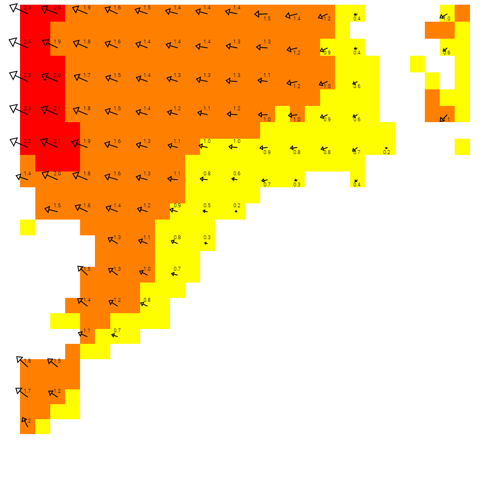

Styling of vector with rotation and add_dataobject datapostproc
===============================================

To draw a vector, you need two components: its magnitude (or “strength”) and its direction. If your dataset provides only the direction, or if the magnitude and direction are stored in separate files, you can use datapostproc to combine them.

A vector element expects the first data object to contain the magnitude and the second to contain the direction.

[Back to readme](./Readme.md).

## Single direction component
If your dataset contains only a direction component (for example, wave direction in degrees), you need to create a corresponding dummy magnitude using the `add_dataobject` datapostproc.

In the configuration file below, a single NetCDF file provides wave direction in degrees. The `add_dataobject` datapostproc is used to create a magnitude variable with a constant value of 1, allowing the vector to be drawn correctly.

```xml
  <Style name="wind_wave_direction">
    <DataPostProc algorithm="add_dataobject" name="dummy-magnitude" a="1" />
    <DataPostProc algorithm="pointsfromgrid" select="dummy-magnitude,wind-wave-from-direction-mean-msl" a="50"/>

    <RenderSettings drawgrid="false" />
    <Vector vectorstyle="vector" linecolor="#000000" linewidth="2.0" scale="40.0" />
  </Style>

  <Layer type="database">
    <Group collection="msl"/>
    <Name>wind_wave_direction</Name>
    <Title>Wind wave direction</Title>
    <Variable>wind-wave-from-direction-mean-msl</Variable>
    <FilePath gfi_openall="true" filter="(wind-wave-from-direction-mean-msl_[0-9T]{11}\.nc)">{ADAGUC_PATH}/data/datasets/wave_data/wind-wave-from-direction-mean-msl_20260126T06.nc</FilePath>
    <Styles>wind_wave_direction</Styles>
    <Dimension name="forecast_reference_time" units="ISO8601" type="reference_time">reference_time</Dimension>
    <Dimension name="time" units="ISO8601" interval="PT1H" default="forecast_reference_time+PT1H" type="time">time</Dimension>
    <Dimension name="msl" units=" " default="min" type="vertical" hidden="true">mean_sea_level</Dimension>
  </Layer>
```

The two variables, `dummy-magnitude` and `wind-wave-from-direction-mean-msl`, are then converted to point data using the `pointsfromgrid` datapostproc. This conversion is required because vector rendering operates on point data, not gridded fields.

Using the configuration above results in the following image:


Note that every vector has the same length, since the magnitude was set to a constant value.

This example is also included as the test case `test_WMSGetMap_wave_direction_vector_with_add_dataobject`.

## Direction and strength component in different files

If you have both a direction and a speed component, but they are stored in separate NetCDF files, you can use the `include_layer` datapostproc to combine them into a single layer.

In the configuration below, two layers are defined, each referencing a different NetCDF file. Both layers have the `gfi_openall` attribute set so that each file can be opened when needed.

The `include_layer` datapostproc is used to embed the `wind_wave_height` layer inside the `wind_wave_direction_and_height` layer. As a result, both variables (`wind-wave-height-significant-msl` and `wind-wave-from-direction-mean-msl`) become available for styling.

Both variables are then used to draw vectors (via `pointsfromgrid`). The `ShadeInterval` style is applied only to the first data object, which in this setup corresponds to the `wind_wave_height` layer.

```xml
  <Style name="wind_wave_direction_and_height">
    <DataPostProc algorithm="include_layer" name="wind_wave_height" mode="prepend"/>
    <DataPostProc algorithm="pointsfromgrid" select="wind-wave-height-significant-msl,wind-wave-from-direction-mean-msl" a="50"/>

    <IncludeStyle name="_wind_wave_height_discete" />
    <Vector vectorstyle="vector" fontsize="14" plotvalue="true" textcolor="#55555" linecolor="#000000" linewidth="2.0" scale="20.0" />
  </Style>

  <Style name="wind_wave_height">
    <IncludeStyle name="_wind_wave_height_discete" />
  </Style>

  <Style name="_wind_wave_height_discete">
    <ShadeInterval min="0" max="1" label="0-1" fillcolor="#ffff00"/>
    <ShadeInterval min="1" max="2" label="1-2" fillcolor="#ff8000"/>
    <ShadeInterval min="2" max="3" label="2-3" fillcolor="#ff0000"/>
    <RenderSettings renderhint="discreteclasses" />
  </Style>

  <Layer type="database">
    <Group collection="msl"/>
    <Name>wind_wave_direction_and_height</Name>
    <Title>Wind wave direction and significant height</Title>
    <Variable>wind-wave-from-direction-mean-msl</Variable>
    <FilePath gfi_openall="true" filter="(wind-wave-from-direction-mean-msl_[0-9T]{11}\.nc)">{ADAGUC_PATH}/data/datasets/wave_data/wind-wave-from-direction-mean-msl_20260126T06.nc</FilePath>
    <Styles>wind_wave_direction_and_height</Styles>
    <Dimension name="forecast_reference_time" units="ISO8601" type="reference_time">reference_time</Dimension>
    <Dimension name="time" units="ISO8601" interval="PT1H" default="forecast_reference_time+PT1H" type="time">time</Dimension>
    <Dimension name="msl" units=" " default="min" type="vertical" hidden="true">mean_sea_level</Dimension>
  </Layer>
  <Layer type="database">
    <Group collection="msl"/>
    <Name>wind_wave_height</Name>
    <Title>Wind wave height significant</Title>
    <Styles>wind_wave_height</Styles>
    <Dimension name="forecast_reference_time" units="ISO8601" type="reference_time">reference_time</Dimension>
    <Dimension name="time" units="ISO8601" interval="PT1H" default="forecast_reference_time+PT1H" type="time">time</Dimension>
    <Dimension name="msl" units=" " default="min" type="vertical" hidden="true">mean_sea_level</Dimension>
  </Layer>
```
Using the configuration above results in the following image:


Note that the vector lengths are now dynamic. Their magnitude is determined by the first data object in the combined layer, in this example, the `wind-wave-height-significant-msl` variable.

This example is also included in the test case `test_WMSGetMap_wave_direction_vector`.

## More info

For more details on datapostproc usage, see [DataPostProc.md](../configuration/DataPostProc.md).