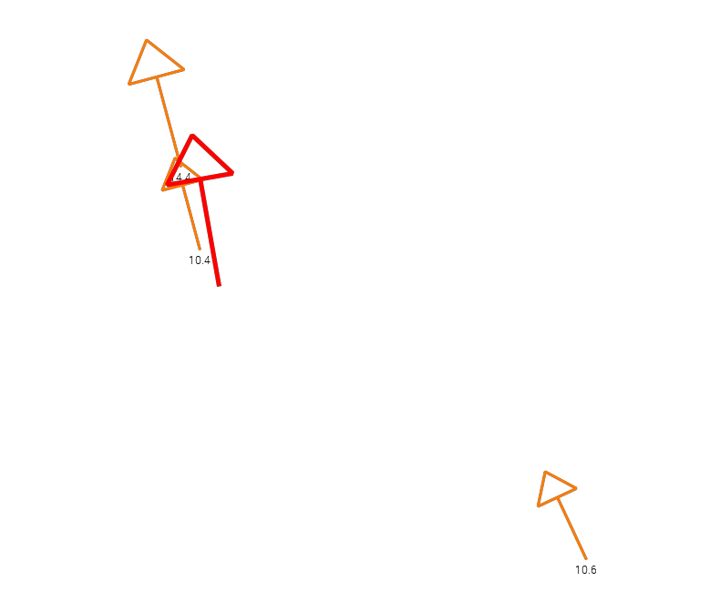
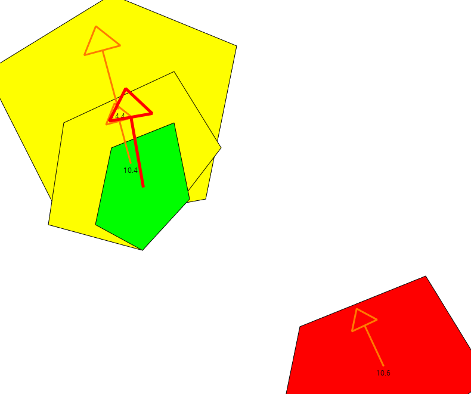

Styling of vectors derived from GeoJSON feature properties with pointsfromfeature
===============================================

To draw a vector, you need two components: its magnitude and its direction. The `pointsfromfeature` datapostproc lets you derive both directly from named properties on the features of a GeoJSON `FeatureCollection`.

A vector element expects the first data object to contain the magnitude and the second to contain the direction, so list the `select` properties in that order.

[Back to readme](./Readme.md).

## Deriving vectors directly from GeoJSON properties

Consider a warning GeoJSON file where each feature carries a wind speed and direction as properties:

```json
{
  "type": "Feature",
  "geometry": { "type": "Polygon", "coordinates": [ ... ] },
  "properties": {
    "warning_code": 2,
    "speed_ms": 14.4,
    "direction_degrees": 75
  }
}
```

The `pointsfromfeature` datapostproc reads `speed_ms` and `direction_degrees` straight from each feature's properties and turns them into point data suitable for vector rendering:

```xml
<Style name="warning_vectors_per_feature" title="Warning vectors per feature">
  <RenderMethod>point</RenderMethod>
  <Vector min="0" max="5" vectorstyle="vector" linewidth="2" linecolor="#FFFF00" scale="10" plotvalue="true" textcolor="#000000"/>
  <Vector min="5" max="15" vectorstyle="vector" linewidth="3" linecolor="#FF7B00" scale="10" plotvalue="true" textcolor="#000000"/>
  <Vector min="15" vectorstyle="vector" linewidth="5" linecolor="#FF0000" scale="10"/>
  <DataPostProc algorithm="pointsfromfeature" select="speed_ms,direction_degrees"/>
</Style>

<Layer type="database">
  <Name>pff_test</Name>
  <Title>GeoJSON Points From Feature Test</Title>
  <FilePath>{ADAGUC_PATH}data/datasets/geojsons/warnings.example.geojson</FilePath>
  <Variable>features</Variable>
  <Styles>warning_vectors_per_feature</Styles>
</Layer>
```

Please note:

- `select` takes a comma-separated list of GeoJSON property names, magnitude first and direction second — matching the general vector rule above.
- The named properties don't need to already exist as CDF variables. If a property isn't already registered, `pointsfromfeature` creates one automatically, bound to the source's x/y dimensions, so you can select any property present in your GeoJSON's `properties` block without further configuration.
- Every geometry type is supported: `Point` features use their own coordinate, `Polygon` features use their centroid, and `LineString` features use their first vertex.

Using the configuration above results in the following image:



This example is also included as the test case `test_WMSGetMap_warning_vectors_per_feature`.

## Discrete, classified legend

Because this style uses `RenderMethod=point`, adding `ShadeInterval` elements directly inside the style switches the legend to discrete, instead of a continuous gradient:

```xml
<Style name="warning_vectors_per_feature" title="Warning vectors per feature">
  <RenderMethod>point</RenderMethod>
  <ShadeInterval min="0"  max="5"  label="0-5 m/s"  fillcolor="#FFFF00FF"/>
  <ShadeInterval min="5"  max="15" label="5-15 m/s" fillcolor="#FF7B00FF"/>
  <ShadeInterval min="15" max="50" label="15+ m/s"  fillcolor="#FF0000FF"/>
  <Vector min="0" max="5" vectorstyle="vector" linewidth="2" linecolor="#FFFF00" scale="10" plotvalue="true" textcolor="#000000"/>
  <Vector min="5" max="15" vectorstyle="vector" linewidth="3" linecolor="#FF7B00" scale="10" plotvalue="true" textcolor="#000000"/>
  <Vector min="15" vectorstyle="vector" linewidth="5" linecolor="#FF0000" scale="10"/>
  <DataPostProc algorithm="pointsfromfeature" select="speed_ms,direction_degrees"/>
</Style>
```

## Combining two styled layers in one image

To draw more than one style over the same (or a related) GeoJSON source in a single request use `<AdditionalLayer>` to overlay a second layer's style onto the first. In this case, we represent
the polygons and vectors at the same time:

```xml
<Layer type="database">
  <Name>pff_test_points_and_features</Name>
  <Title>GeoJSON Points From Feature Test</Title>
  <FilePath>{ADAGUC_PATH}data/datasets/geojsons/warnings.example.geojson</FilePath>
  <Variable>features</Variable>
  <Styles>polygon_per_feature_code</Styles>
  <AdditionalLayer replace="false" style="warning_vectors_per_feature">pff_test</AdditionalLayer>
</Layer>
```


Using the configuration above results in the following image:



This example is also included as the test case `test_WMSGetMap_warning_points_and_features`.

## More info

For more details on datapostproc usage, see [DataPostProc.md](../configuration/DataPostProc.md).